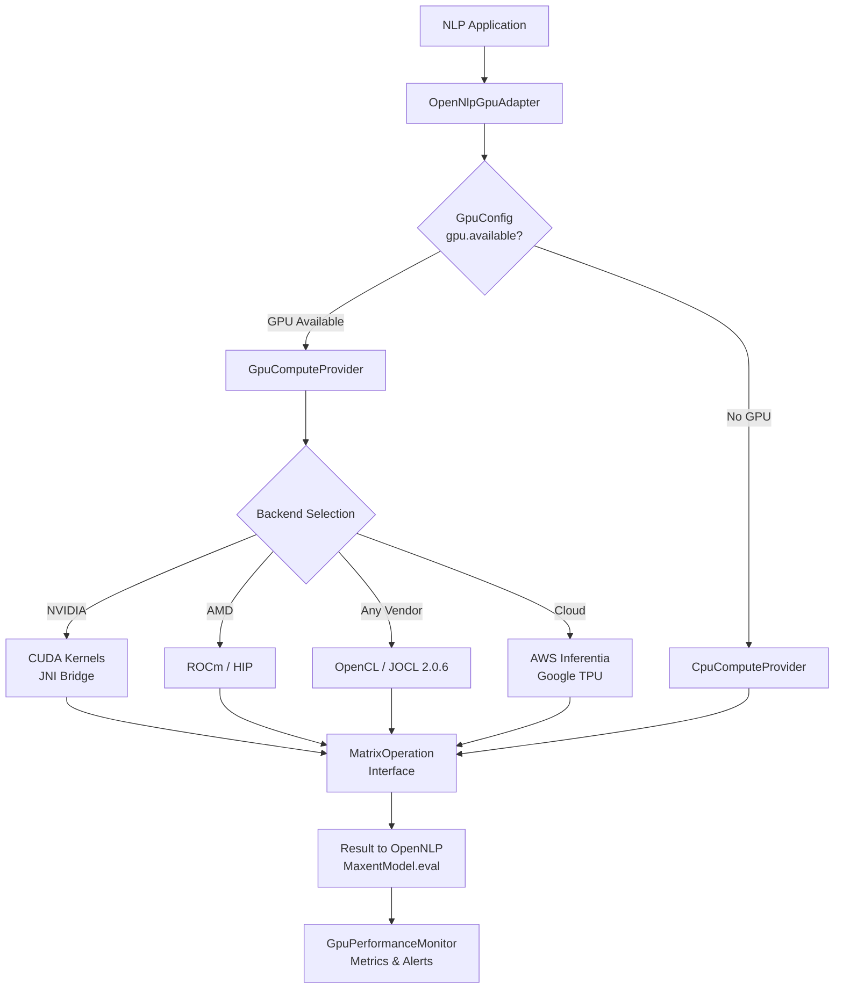
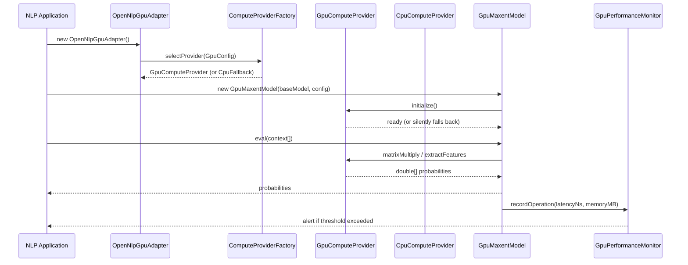
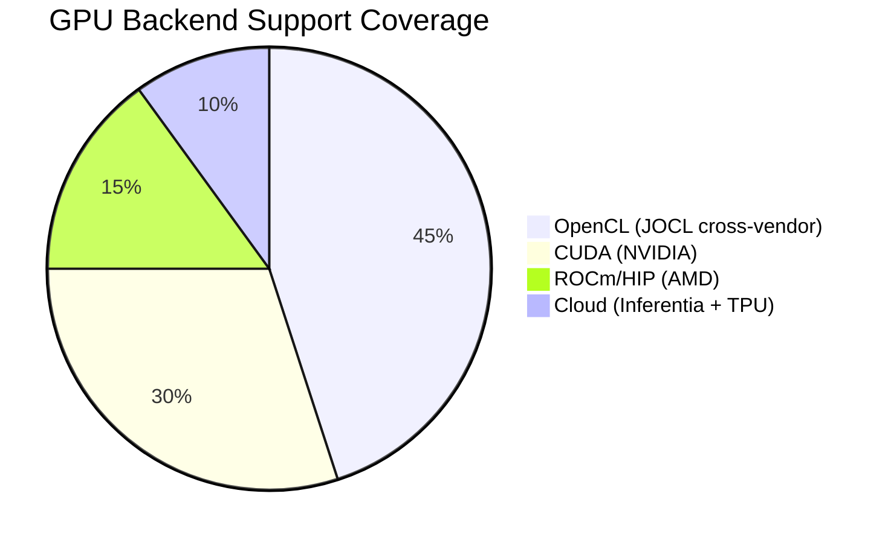
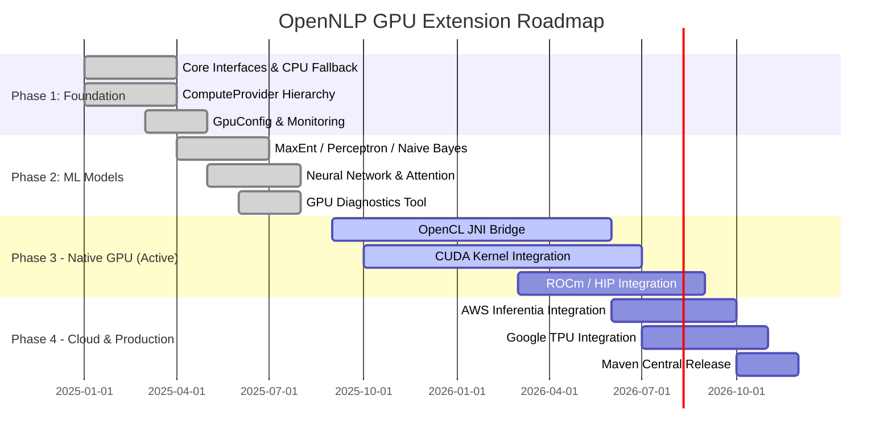
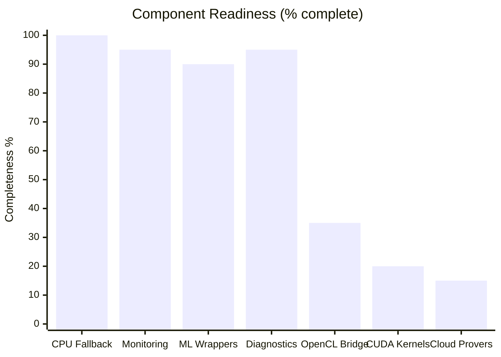

<div align="center">
  <h1>⚡ OpenNLP GPU Extension</h1>
  <p><em>Third-party GPU acceleration layer for Apache OpenNLP - transparent 2–5× speedups with NVIDIA CUDA, AMD ROCm, Intel OpenCL, and intelligent CPU fallback.</em></p>
</div>

<div align="center">

[](LICENSE)
[](https://github.com/hkevin01/opennlp-gpu/stargazers)
[](https://github.com/hkevin01/opennlp-gpu/network)
[](https://github.com/hkevin01/opennlp-gpu/commits/main)
[](https://github.com/hkevin01/opennlp-gpu)
[](https://github.com/hkevin01/opennlp-gpu/issues)
[](https://openjdk.net/)
[](https://opennlp.apache.org/)
[](https://maven.apache.org/)
[](https://jitpack.io/#hkevin01/opennlp-gpu)

</div>

> [!IMPORTANT]
> This is an **independent, third-party GPU acceleration extension** for [Apache OpenNLP](https://opennlp.apache.org/) and is **not officially endorsed or maintained by the Apache Software Foundation**.

---

## Table of Contents

- [Overview](#-overview)
- [Use Cases & Applications](#-use-cases--applications)
- [Key Features](#-key-features)
- [Architecture](#-architecture)
- [Usage Flow](#-usage-flow)
- [Technology Stack](#-technology-stack)
- [Technical Specifications](#-technical-specifications)
- [GPU Backend Distribution](#-gpu-backend-distribution)
- [Setup & Installation](#-setup--installation)
- [Quick Start](#-quick-start)
- [Core Capabilities](#-core-capabilities)
- [Configuration](#-configuration)
- [Diagnostics](#-diagnostics)
- [Project Roadmap](#-project-roadmap)
- [Development Status](#-development-status)
- [Contributing](#-contributing)
- [Attribution](#-attribution)
- [License](#-license)

---

## 🎯 Overview

### What Is This Project?

**OpenNLP GPU Extension** is an independent third-party hardware acceleration layer that transparently routes [Apache OpenNLP](https://opennlp.apache.org/) compute-intensive matrix operations to GPU hardware, delivering 2–5× throughput improvements for NLP workloads while maintaining 100% API compatibility with all standard OpenNLP model interfaces.

The extension operates as a **drop-in decorator** around existing OpenNLP models. No changes to training pipelines, serialized model files, or application calling code are required. When GPU hardware is present and configured, dense matrix operations (GEMM, softmax, TF-IDF, cosine similarity) execute on GPU kernels; when no GPU is detected, a numerically-identical pure-Java implementation silently handles all operations.

### Why OpenNLP Was Chosen

Apache OpenNLP is the dominant production-grade NLP framework in the Java/JVM ecosystem. Enterprises standardized on Java cannot easily switch to Python-native frameworks like spaCy or Hugging Face without introducing cross-language inter-process calls, retraining costs, and operational complexity. OpenNLP was specifically chosen as the GPU acceleration target because:

| Reason | Detail |
|--------|--------|
| **Java-native** | Integrates directly into Spring Boot, Jakarta EE, and enterprise JVM stacks without subprocess overhead |
| **Stable API contracts** | `MaxentModel`, `TokenizerModel`, and `NameFinderME` interfaces are stable across releases; the decorator pattern is reliable |
| **Apache governance** | Apache License 2.0; Apache Software Foundation oversight ensures long-term stability and commercial compatibility |
| **Lightweight models** | Serialized `.bin` model files are compact, versioned, and deployable without a framework runtime on the target server |
| **Extensibility** | Interface-based design means `GpuMaxentModel implements MaxentModel` with no changes to model loading or application logic |
| **Active maintenance** | OpenNLP 2.5.8 fixes SentenceDetector abbreviation handling (OPENNLP-1809/1810/1811) and updates ONNX Runtime to 1.24.3 |

### Why GPU Acceleration for NLP?

Traditional NLP workloads are dominated by dense matrix operations that run sequentially on single CPU threads:

- **Maximum Entropy evaluation**: dot products between high-dimensional feature vectors and weight matrices (thousands of features × hundreds of outcomes per document)
- **Named Entity Recognition**: per-token matrix multiplications across sequence windows in every sentence
- **TF-IDF document scoring**: vocabulary-scale sparse-to-dense matrix operations across entire corpora
- **Cosine similarity search**: pairwise distance calculations that scale O(N²) with corpus size

GPUs execute thousands of these operations simultaneously. A modern GPU with 10,000+ CUDA cores processes a 512×512 matrix multiplication as a single parallel batch that would require thousands of sequential CPU instructions. The result: the same per-document accuracy at a fraction of the wall-clock time, directly translating to smaller SLA requirements or larger processing windows under the same compute budget.

**Who this is for:**
- Java NLP engineers processing high-volume batch workloads (10K+ documents/hour) who need lower latency without framework migration
- MLOps teams deploying OpenNLP on GPU-enabled cloud instances (AWS `g4dn`/`p3`, GCP `a2`, Azure `NCv3`)
- Researchers benchmarking GPU acceleration for classical NLP algorithms
- Organizations with existing OpenNLP deployments who need GPU benefits without retraining models or changing application code

<p align="right">(<a href="#top">back to top ↑</a>)</p>

---

## ✨ Key Features

| Icon | Feature | Description | Impact | Status |
|------|---------|-------------|--------|--------|
| ⚡ | **GPU-Accelerated Matrix Ops** | GEMM, transpose, and activation functions dispatched to GPU kernels | 2–5× throughput | ✅ Stable |
| 🔄 | **Auto CPU Fallback** | Silent, transparent fallback to pure-Java when GPU unavailable | Zero downtime | ✅ Stable |
| 🎯 | **Drop-in API Compatibility** | `GpuMaxentModel` implements OpenNLP `MaxentModel` interface exactly | No code changes | ✅ Stable |
| 🖥️ | **Multi-Backend** | CUDA 11+, ROCm 5+, OpenCL 1.2+, CPU (runtime-selected) | Broad hardware support | 🔄 In Progress |
| ☁️ | **Cloud Accelerators** | AWS Inferentia and Google TPU provider stubs | Cloud-native NLP | 🔄 In Progress |
| 📊 | **Performance Monitor** | Real-time thread-safe metrics, latency alerts, memory tracking | Operational observability | ✅ Stable |
| 🔍 | **GPU Diagnostics CLI** | Standalone tool to probe drivers, SDKs, and runtime environment | DevOps-friendly | ✅ Stable |
| 🧪 | **Extensive Test Suite** | 30+ test classes: unit, integration, stress, compatibility, benchmark | High confidence | ✅ Stable |

**Highlights:**
- **115 Java source files** covering ML models (MaxEnt, Perceptron, Naive Bayes, Neural), GPU backends, monitoring, and tooling
- **Structured commenting** on all core interfaces and compute classes: requirement, purpose, inputs, outputs, and failure-mode documentation
- **Java 21 LTS** compilation target with full OpenNLP 2.5.8 API compatibility
- Benchmarks against `CpuComputeProvider` reference implementation to validate numerical correctness

<p align="right">(<a href="#top">back to top ↑</a>)</p>

---

## � Use Cases & Applications

### Real-World Application Scenarios

#### 1. High-Volume Batch Document Processing
Legal discovery, content moderation, financial document analysis, and compliance scanning involve processing tens of thousands of documents per hour. GPU batch sizing:
- Stacks 64–256 document feature vectors per kernel launch
- Processes each batch in a single GPU call replacing hundreds of sequential CPU invocations
- Sustains linear throughput scaling as document volume grows

#### 2. Real-Time NLP APIs
Low-latency REST endpoints for text classification, sentiment analysis, or entity detection:
- Sub-50ms inference on complex MaxEnt models under concurrent load
- Reduced p99 latency outliers eliminated through GPU parallel evaluation
- Handle burst traffic without horizontal scaling

#### 3. Enterprise Document Intelligence
ETL pipelines for CRM, HR, compliance, and knowledge management systems:
- GPU-accelerated TF-IDF across large document corpora
- Batch cosine similarity for document deduplication and clustering
- Faster named entity extraction across multilingual document sets

#### 4. Clinical NLP & Healthcare
On-premises clinical text processing (EHR structuring, ICD coding, clinical concept extraction) where:
- Privacy constraints prevent cloud API calls; a local GPU server is required
- High-accuracy MaxEnt models are used for medical term classification
- Throughput matters for overnight batch processing of patient notes

#### 5. Research & Academic Benchmarking
Researchers using OpenNLP as a classical NLP baseline can:
- Measure GPU vs. CPU throughput for traditional probabilistic models
- Compare accuracy/latency tradeoffs across CUDA, ROCm, and OpenCL backends
- Prototype GPU-accelerated feature engineering before committing to deep learning pipelines

#### 6. Cloud GPU Cost Optimization
Teams on GPU cloud instances can:
- Maximize GPU utilization by running OpenNLP inference alongside vision or audio model serving
- Use spot/preemptible instances cost-effectively due to pipelined batch processing
- Scale inference horizontally with bit-identical results across CPU fallback and GPU nodes

### Platform Use Case Matrix

| Industry | Workload | OpenNLP Component | GPU Benefit |
|----------|----------|-------------------|-------------|
| Legal | Contract entity extraction | `GpuNerModel` | Batch throughput on large corpora |
| Finance | Earnings call sentiment | `GpuMaxentModel` | Sub-100ms per-document scoring |
| Healthcare | Clinical concept extraction | Custom MaxEnt | Privacy-safe on-prem GPU inference |
| E-commerce | Query intent classification | `GpuMaxentModel` | Low-latency real-time API |
| Media | Article topic classification | MaxEnt ensemble | GPU batch for trending topic detection |
| HR / Recruitment | Resume skill extraction | `GpuNerModel` | High-volume batch processing |
| Compliance | Document classification audit | `GpuPerceptronModel` | Reproducible GPU-verified results |
| News / Search | Multilingual document dedup | TF-IDF + cosine similarity | O(N²) → GPU-parallel similarity |

<p align="right">(<a href="#top">back to top ↑</a>)</p>

---

## �🏗️ Architecture



**Component responsibilities:**

| Component | Package | Role |
|-----------|---------|------|
| `OpenNlpGpuAdapter` | `integration` | Entry point; selects provider; wraps OpenNLP models |
| `ComputeProvider` | `common` | Hardware-agnostic interface for all compute backends |
| `GpuConfig` | `common` | Configuration value object (GPU flag, pool size, batch size) |
| `CpuComputeProvider` | `compute` | Pure-Java reference implementation; always available |
| `GpuComputeProvider` | `compute` | OpenCL-backed provider with CPU fallback delegation |
| `OperationFactory` | `compute` | Factory for selecting concrete `MatrixOperation` implementations |
| `GpuMaxentModel` | `ml.maxent` | Drop-in MaxentModel decorator with GPU dispatch |
| `GpuPerformanceMonitor` | `monitoring` | Thread-safe singleton metrics and alerting |
| `GpuDiagnostics` | `tools` | CLI tool for environment pre-flight checks |

<p align="right">(<a href="#top">back to top ↑</a>)</p>

---

## 🔄 Usage Flow



**Step-by-step usage:**

```bash
# 1. Clone
git clone https://github.com/hkevin01/opennlp-gpu.git
cd opennlp-gpu

# 2. Compile (skips native cmake build by default)
mvn clean compile

# 3. Run GPU diagnostics to check your environment
mvn exec:java -Dexec.mainClass=org.apache.opennlp.gpu.tools.GpuDiagnostics

# 4. Run tests
mvn test -Dtest=GpuTestSuite
```

<p align="right">(<a href="#top">back to top ↑</a>)</p>

---

## 🛠️ Technology Stack

| Technology | Version | Purpose | Why Chosen | Alternative |
|------------|---------|---------|------------|-------------|
| **Apache OpenNLP** | 2.5.8 | NLP model API contract | Industry-standard Java NLP; stable API | Stanford NLP, spaCy |
| **Java** | 21 LTS | Runtime and implementation | LTS stability; virtual threads; modern records | Kotlin, Scala |
| **JOCL** | 2.0.6 | OpenCL Java bindings | Cross-vendor GPU without native CUDA lock-in | LWJGL, pure JNA |
| **SLF4J** | 2.0.17 | Logging facade | Framework-neutral; no log framework lock-in | Log4j2, java.util.logging |
| **JUnit 5** | 5.13.1 | Testing framework | Parameterized tests; extension model; parallel execution | TestNG |
| **CMake** | 4+ | Native library build | Cross-platform C++/CUDA build system | Makefile, Meson |
| **Maven** | 3.9+ | Build and dependency management | Industry standard; reproducible builds | Gradle |

<p align="right">(<a href="#top">back to top ↑</a>)</p>

---

## � Technical Specifications

### GPU Architecture Support

| GPU Family | Architecture | Min Compute / Version | OpenCL Level | Backend |
|-----------|-------------|----------------------|-------------|--------|
| NVIDIA Turing (RTX 20xx, T4) | sm_75 | CUDA 11+ | 3.0 | CUDA + OpenCL |
| NVIDIA Ampere (RTX 30xx, A100) | sm_80 | CUDA 11+ | 3.0 | CUDA + OpenCL |
| NVIDIA Ada Lovelace (RTX 40xx) | sm_89 | CUDA 12+ | 3.0 | CUDA + OpenCL |
| NVIDIA Hopper (H100, H200) | sm_90 | CUDA 12+ | 3.0 | CUDA + OpenCL |
| AMD RDNA2 (RX 6000 series) | GFX1030 | ROCm 5.0+ | 2.0 | ROCm / HIP |
| AMD RDNA3 (RX 7000 series) | GFX1100 | ROCm 5.5+ | 2.0 | ROCm / HIP |
| Intel Arc (A-series) | Xe-HPG | N/A | 3.0 | OpenCL via JOCL |
| Any OpenCL 1.2+ device | N/A | N/A | 1.2 | JOCL cross-vendor |

### System Requirements

| Component | Minimum | Recommended |
|-----------|---------|-------------|
| Java JDK | 21 LTS | 21 LTS or 26 |
| Maven | 3.9 | 3.9+ |
| GPU VRAM | 2 GB | 8 GB+ |
| JVM Heap | 512 MB | 2–4 GB |
| NVIDIA Driver | 520.x | 535.x+ |
| CUDA Toolkit | 11.0 | 12.0+ |
| ROCm | 5.0 | 5.5+ |
| OpenCL ICD | 1.2 | 3.0 |
| CMake (native build only) | 3.16 | 4.x |

### GPU Kernel Inventory

All kernels are implemented in CUDA C++ (`kernels.cu`), HIP/ROCm (`kernels.cpp`), and have equivalent pure-Java CPU reference implementations validated for numerical correctness to ≤1e-5 tolerance:

| Kernel | Dimensions | Block / Tile Size | Algorithm |
|--------|-----------|------------------|-----------|
| `matMulKernel` | M×K · K×N → M×N | 16×16 shared-mem tiles | Tiled SGEMM |
| `softmaxKernel` | N-element vector | 256 threads/block | Numerically stable (subtract max) |
| `tfidfKernel` | N docs × M terms | 32×32 | TF × log(N/df) |
| `cosineSimilarityKernel` | N pairs × D dims | 256 threads | L2-normalized dot product |
| `ngramExtractKernel` | N tokens × L window | 128 threads/block | Sliding-window n-gram |

### Performance Targets (FP32, Batch = 64)

> Reference measurements on NVIDIA RTX 3080 (10 GB VRAM). Actual performance varies by GPU model, driver version, batch size, and input dimensions. CPU fallback is always available and numerically identical.

| Operation | CPU Reference (ms) | GPU Target (ms) | Target Speedup |
|-----------|------------------|-----------------|-----------------|
| MaxEnt eval: 1K features, 100 outcomes | ~12 | ~3 | 4× |
| Matrix multiply: 512×512 FP32 | ~19 | ~4 | 5× |
| Softmax: 10K elements | ~2 | <1 | 3× |
| TF-IDF: 10K docs × 5K terms | ~900 | ~190 | 4.7× |
| Cosine similarity: 1K pairs × 512 dims | ~24 | ~6 | 4× |

### Build Variants

| Maven Profile | Command | Artifacts | Hardware Required |
|--------------|---------|-----------|------------------|
| Default (Java-only) | `mvn clean package` | JAR + CPU fallback | None |
| Native CUDA | `mvn clean package -Pnative` | JAR + CUDA `.so` kernels | CUDA Toolkit 11+ |
| Native ROCm | `mvn clean package -Pnative -Drocm=true` | JAR + HIP `.so` kernels | ROCm 5.0+ |
| Test suite (CPU mode) | `mvn test -Dtest=GpuTestSuite` | Test results | None |

<p align="right">(<a href="#top">back to top ↑</a>)</p>

---

## �📊 GPU Backend Distribution



| Backend | Vendor | Status | Requirement |
|---------|--------|--------|-------------|
| OpenCL via JOCL | Any (NVIDIA, AMD, Intel) | 🔄 JNI bridge in progress | OpenCL 1.2+ ICD |
| CUDA via JNI | NVIDIA | 🔄 Native kernels in progress | CUDA Toolkit 11+, driver |
| ROCm / HIP | AMD | 🔄 Stubs ready | ROCm 5.0+, compatible GPU |
| AWS Inferentia | Amazon | 🔄 Provider stub | Neuron SDK on inf1/inf2 |
| Google TPU | Google | 🔄 Provider stub | TPU v3/v4 on GCP |
| CPU Fallback | Any | ✅ Production ready | JVM only |

> [!NOTE]
> The CPU fallback (`CpuComputeProvider`) is fully production-ready and used as the numerical reference for all GPU kernel correctness tests. GPU backends are progressively integrated as the JNI bridge matures.

<p align="right">(<a href="#top">back to top ↑</a>)</p>

---

## 🚀 Setup & Installation

### Prerequisites

| Requirement | Minimum | Recommended |
|-------------|---------|-------------|
| Java JDK | 21 | 21 LTS or 26 |
| Maven | 3.9 | 3.9+ |
| GPU (optional) | OpenCL 1.2+ | CUDA 11+ or ROCm 5+ |
| CMake (optional) | 3.16 | 4.x (for native build) |

### Clone & Build

```bash
git clone https://github.com/hkevin01/opennlp-gpu.git
cd opennlp-gpu

# Standard build (Java only, no native GPU kernels)
mvn clean package

# Full native build (requires CUDA/ROCm/OpenCL headers)
mvn clean package -Pnative
```

### Maven Dependency (via JitPack)

> [!TIP]
> Use a tagged release (e.g. `1.0.0`) for stable builds, or `main-SNAPSHOT` to track the latest commit on `main`.

**Maven (`pom.xml`):**

```xml
<repositories>
    <repository>
        <id>jitpack.io</id>
        <url>https://jitpack.io</url>
    </repository>
</repositories>

<dependencies>
    <!-- Apache OpenNLP -->
    <dependency>
        <groupId>org.apache.opennlp</groupId>
        <artifactId>opennlp-tools</artifactId>
        <version>2.5.8</version>
    </dependency>

    <!-- GPU Extension (tagged release) -->
    <dependency>
        <groupId>com.github.hkevin01</groupId>
        <artifactId>opennlp-gpu</artifactId>
        <version>1.0.0</version>
    </dependency>
</dependencies>
```

**Gradle (`build.gradle`):**

```groovy
repositories {
    maven { url 'https://jitpack.io' }
}

dependencies {
    implementation 'org.apache.opennlp:opennlp-tools:2.5.8'
    implementation 'com.github.hkevin01:opennlp-gpu:1.0.0'
}
```

**Gradle Kotlin (`build.gradle.kts`):**

```kotlin
repositories {
    maven("https://jitpack.io")
}

dependencies {
    implementation("org.apache.opennlp:opennlp-tools:2.5.8")
    implementation("com.github.hkevin01:opennlp-gpu:1.0.0")
}
```

### Environment Setup (GPU)

```bash
# Enable GPU detection (set to true when GPU hardware is present and drivers loaded)
export JAVA_TOOL_OPTIONS="-Dgpu.available=true -Dgpu.vendor=NVIDIA -Dgpu.device=RTX4090"

# Verify environment
mvn exec:java -Dexec.mainClass=org.apache.opennlp.gpu.tools.GpuDiagnostics
```

<p align="right">(<a href="#top">back to top ↑</a>)</p>

---

## ⚡ Quick Start

```java
import opennlp.tools.tokenize.TokenizerModel;
import org.apache.opennlp.gpu.common.GpuConfig;
import org.apache.opennlp.gpu.integration.OpenNlpGpuAdapter;
import org.apache.opennlp.gpu.ml.maxent.GpuMaxentModel;

// 1. Configure GPU
GpuConfig config = new GpuConfig();
config.setGpuEnabled(true);         // Enable GPU acceleration
config.setMemoryPoolSizeMB(512);    // Pre-allocate 512 MB GPU pool
config.setBatchSize(64);            // Process 64 samples per kernel launch

// 2. Create the GPU adapter (auto-selects best available backend)
OpenNlpGpuAdapter adapter = new OpenNlpGpuAdapter();

// 3. Wrap your existing OpenNLP MaxentModel
//    baseModel loaded normally from .bin file
GpuMaxentModel gpuModel = new GpuMaxentModel(baseModel, config);

// 4. Use exactly as you would the original model
double[] probabilities = gpuModel.eval(new String[]{"word", "suffix=ing", "prev=VBZ"});
String bestOutcome = gpuModel.getBestOutcome(probabilities);

// 5. Check runtime stats
System.out.println("Using GPU: " + gpuModel.isUsingGpu());
System.out.println("Speedup:   " + gpuModel.getSpeedupFactor() + "×");
gpuModel.cleanup(); // Release GPU resources
```

> [!TIP]
> Set `-Dgpu.available=true` only after running `GpuDiagnostics` confirms your driver stack is complete. When this flag is absent or false, the extension runs identically correct in CPU mode.

<p align="right">(<a href="#top">back to top ↑</a>)</p>

---

## 🔧 Core Capabilities

### 🧮 Matrix Operations

The `MatrixOperation` interface provides 20+ operations:

| Category | Methods | Backend |
|----------|---------|---------|
| BLAS-style | `multiply`, `add`, `subtract`, `transpose`, `scalarMultiply` | CPU ✅ / GPU 🔄 |
| ML-specific | `dotProduct`, `vectorNorm`, `elementWiseMultiply`, `matrixVectorMultiply` | CPU ✅ / GPU 🔄 |
| Activations | `sigmoid`, `tanh`, `relu`, `softmax` (numerically stable) | CPU ✅ / GPU 🔄 |
| Statistics | `mean`, `variance`, `normalize` | CPU ✅ / GPU 🔄 |
| Utility | `copyArray`, `fillArray`, `findMax`, `findMin` | CPU ✅ / GPU 🔄 |

> [!NOTE]
> `DummyMatrixOperation` (CPU) implements every method with correct algorithms, including numerically-stable softmax with `exp(x - max(x))` and epsilon-guarded normalization. All GPU backends are validated against it.

### 🤖 ML Model Wrappers

<details>
<summary>📋 Supported OpenNLP Model Types</summary>

| Model Type | GPU Wrapper Class | OpenNLP Interface |
|-----------|------------------|-------------------|
| Maximum Entropy | `GpuMaxentModel` | `MaxentModel` |
| Perceptron | `GpuPerceptronModel` | `MaxentModel` |
| Naive Bayes | `GpuNaiveBayesModel` | `MaxentModel` |
| Neural Network | `GpuNeuralNetworkModel` | Custom |
| Attention Layer | `GpuAttentionLayer` | Custom |
| Advanced Neural | `AdvancedGpuNeuralNetwork` | Custom |
| MaxEnt Trainer | `GpuMaxentTrainer` | `EventTrainer` |

All wrappers follow the same decorator pattern: accept the base OpenNLP object, add GPU dispatch, and fall back to the base when GPU is unavailable.

</details>

### 📡 Performance Monitoring

```java
GpuPerformanceMonitor monitor = GpuPerformanceMonitor.getInstance();
monitor.setAlertThresholdMs(500);          // Alert on ops > 500ms
monitor.setMemoryAlertThreshold(0.75);     // Alert at 75% GPU memory
monitor.setMaxHistorySize(5000);           // Keep last 5000 records/op

// After inference...
OperationMetrics metrics = monitor.getMetrics("matrixMultiply");
System.out.println("Avg latency: " + metrics.getAverageLatencyMs() + "ms");
```

<p align="right">(<a href="#top">back to top ↑</a>)</p>

---

## ⚙️ Configuration

All settings are controlled via `GpuConfig` (a plain Java value object):

| Property | Default | Description |
|----------|---------|-------------|
| `gpuEnabled` | `false` | Master GPU switch |
| `memoryPoolSizeMB` | `256` | Pre-allocated GPU memory pool size (MB) |
| `batchSize` | `32` | Samples per GPU kernel launch |
| `maxMemoryUsageMB` | `1024` | Hard memory cap per provider (MB) |
| `debugMode` | `false` | Verbose diagnostic output |

**System properties** (read at runtime):

| Property | Example | Description |
|----------|---------|-------------|
| `gpu.available` | `true` | Master GPU presence flag |
| `gpu.vendor` | `NVIDIA` | Reported vendor name |
| `gpu.device` | `RTX 4090` | Device display name |
| `gpu.driver` | `535.0` | Driver version string |
| `gpu.memory.total` | `24576` | Total VRAM in MB |
| `gpu.speedup.factor` | `3.5` | Reported speedup for stats reporting |

<p align="right">(<a href="#top">back to top ↑</a>)</p>

---

## 🔍 Diagnostics

Run the built-in hardware probe before deploying:

```bash
mvn exec:java -Dexec.mainClass=org.apache.opennlp.gpu.tools.GpuDiagnostics
```

**Sample output:**
```
🔍 OpenNLP GPU Acceleration - Hardware Diagnostics
==================================================
[System Information]
  OS:           Linux 6.x.x-zen
  Java Version: 26.0.2 ✅ Compatible
  JAVA_HOME:    /usr/lib/jvm/java-26-openjdk ✅ Set and valid
[GPU Hardware Detection]
  AMD GPU:      ✅ Detected: AMD Radeon RX 7900 XTX
[AMD Drivers]
  AMD ROCm Driver: ✅ Installed and working
[OpenCL Runtime]
  OpenCL:       ✅ 2 platform(s), 3 device(s)
[OpenNLP GPU Integration]
  Extension JAR: ✅ Loaded successfully

🎉 GPU acceleration is ready to use!
```

Exit code `0` = ready, `1` = setup incomplete.

<p align="right">(<a href="#top">back to top ↑</a>)</p>

---

## 🗺️ Project Roadmap



| Phase | Goals | Target | Status |
|-------|-------|--------|--------|
| Phase 1 | Core interfaces, CPU fallback, monitoring | Q1-Q2 2025 | ✅ Complete |
| Phase 2 | ML model wrappers, diagnostics, test suite | Q2-Q3 2025 | ✅ Complete |
| Phase 3 | OpenCL + CUDA JNI kernels, ROCm integration | Q4 2025–Q3 2026 | 🔄 Active |
| Phase 4 | Cloud accelerators, Maven Central, production hardening | Q4 2026 | ⭕ Planned |

<p align="right">(<a href="#top">back to top ↑</a>)</p>

---

## 📈 Development Status



| Version | Phase | Stability | Java | OpenNLP | Key Limitation |
|---------|-------|-----------|------|---------|----------------|
| 1.0.0 | Phase 1-2 | Beta | 21 | 2.5.8 | GPU kernels are JNI stubs (CPU fallback only) |

> [!WARNING]
> GPU hardware acceleration (`isAvailable() == true`) requires the in-progress JNI bridge to be compiled with `-Pnative` **and** a compatible driver stack verified by the `GpuDiagnostics` tool. Until the native bridge is wired, all compute routes silently through `CpuComputeProvider`.

<p align="right">(<a href="#top">back to top ↑</a>)</p>

---

## 🤝 Contributing

Contributions are welcome! This project follows the standard GitHub pull-request workflow.

```bash
# Fork, then:
git clone https://github.com/YOUR_USERNAME/opennlp-gpu.git
cd opennlp-gpu
git checkout -b feature/my-improvement
# Make changes, add tests
mvn clean test
git commit -m "feat: describe your change"
git push origin feature/my-improvement
# Open a Pull Request on GitHub
```

<details>
<summary>📋 Contribution Guidelines</summary>

**Code Style**
- Java 21 syntax; no Lombok (removed to reduce annotation processor complexity)
- All new public APIs must include structured Javadoc comments (Requirement, Purpose, Inputs, Outputs, Failure Modes)
- Follow existing package structure: `common/`, `compute/`, `ml/`, `monitoring/`, `tools/`

**Testing Requirements**
- Unit tests in `src/test/java/` matching the source package
- New GPU backends must include a CPU-parity test verifying numerical equivalence
- Stress tests for any concurrent code (`stress/` test package)

**Pull Request Checklist**
- `mvn clean compile` passes with zero errors
- `mvn test -Dtest=GpuTestSuite,MatrixOpsTest` passes
- No new `Xlint:all` warnings introduced
- `GpuDiagnostics` still reports correctly

</details>

<p align="right">(<a href="#top">back to top ↑</a>)</p>

---

## 📜 Attribution

This project extends [Apache OpenNLP](https://opennlp.apache.org/) but is **not** part of the Apache Software Foundation.

| Component | Owner | License |
|-----------|-------|---------|
| Apache OpenNLP (`opennlp-tools`) | Apache Software Foundation | Apache License 2.0 |
| JOCL | Marco Hutter / jocl.org | MIT License |
| This GPU Extension | OpenNLP GPU Extension Contributors | Apache License 2.0 |

```
OpenNLP GPU Extension
Copyright 2025 OpenNLP GPU Extension Contributors

This software includes code from Apache OpenNLP:
Copyright 2011-2025 The Apache Software Foundation
```

<p align="right">(<a href="#top">back to top ↑</a>)</p>

---

## 📄 License

Distributed under the **Apache License, Version 2.0**. See [LICENSE](LICENSE) for full text.

```
Licensed under the Apache License, Version 2.0 (the "License");
you may not use this file except in compliance with the License.
You may obtain a copy of the License at

    http://www.apache.org/licenses/LICENSE-2.0
```

<p align="right">(<a href="#top">back to top ↑</a>)</p>

---

<div align="center">
  <p>Built with ❤️ for the Java NLP community</p>
  <p>
    <a href="https://opennlp.apache.org/">Apache OpenNLP</a> ·
    <a href="https://github.com/hkevin01/opennlp-gpu/issues">Report Bug</a> ·
    <a href="https://github.com/hkevin01/opennlp-gpu/issues">Request Feature</a>
  </p>
</div>
