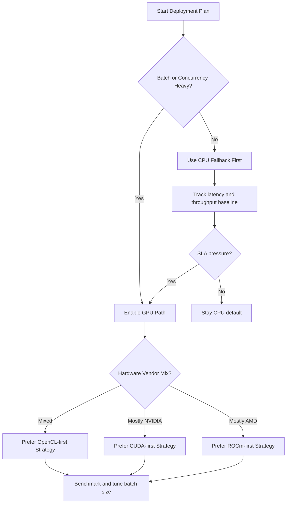
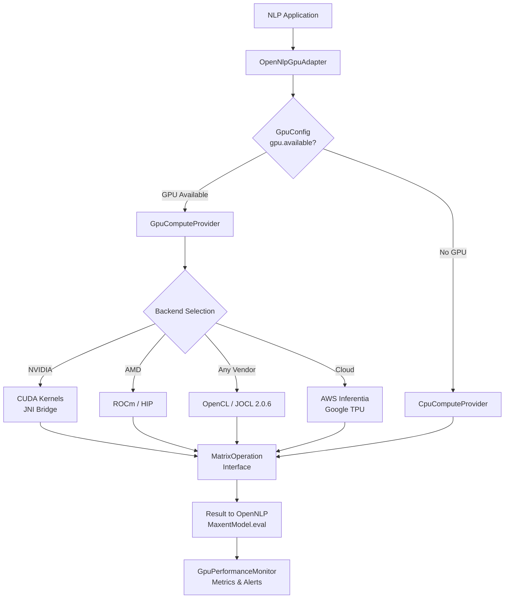
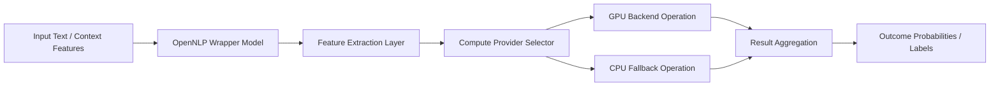
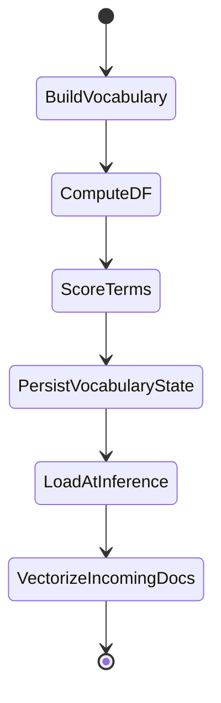
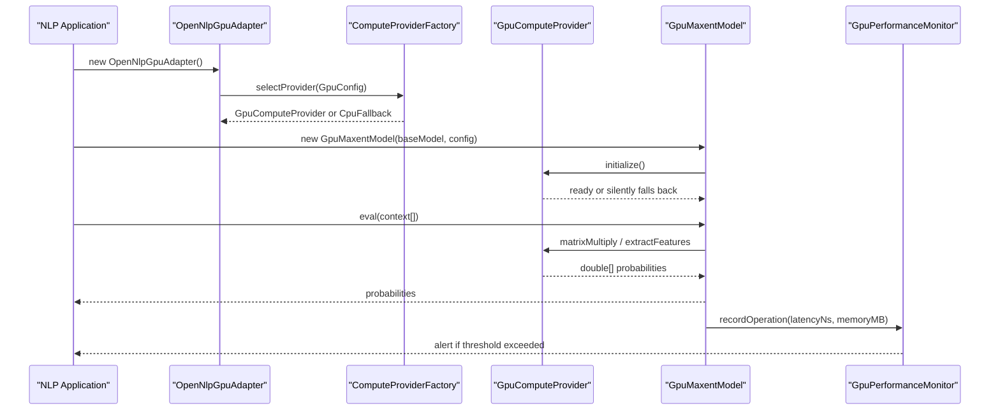
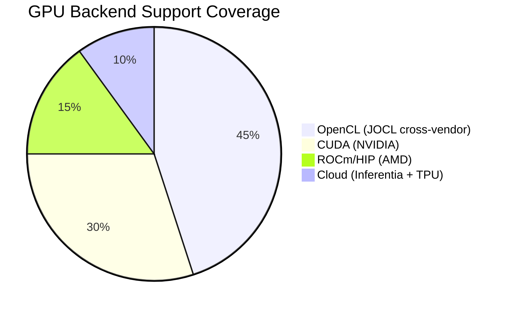
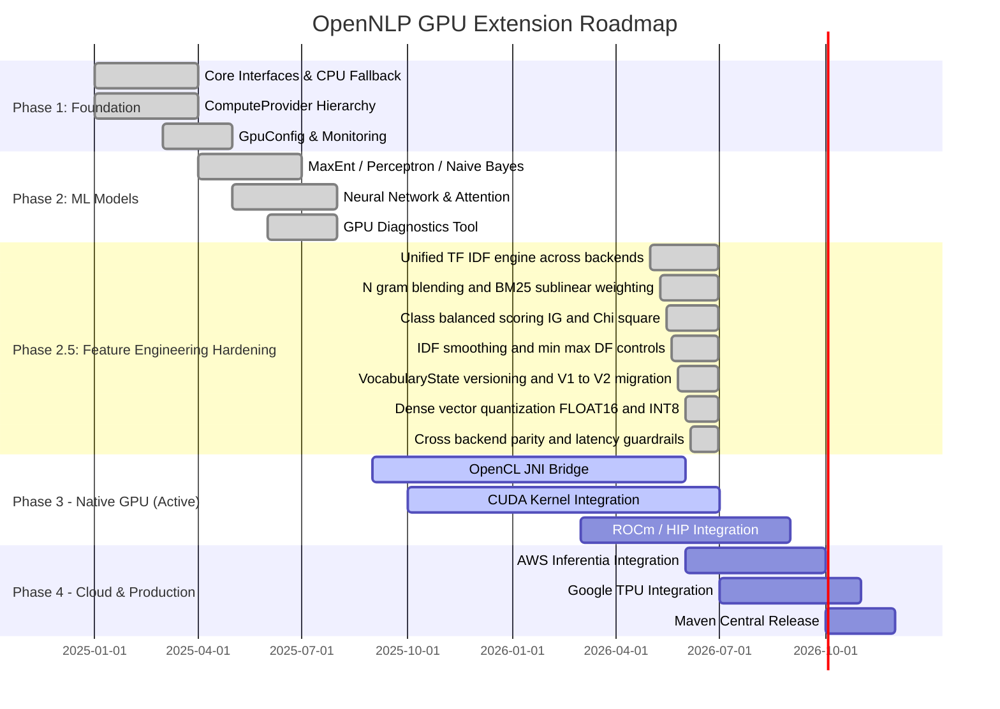
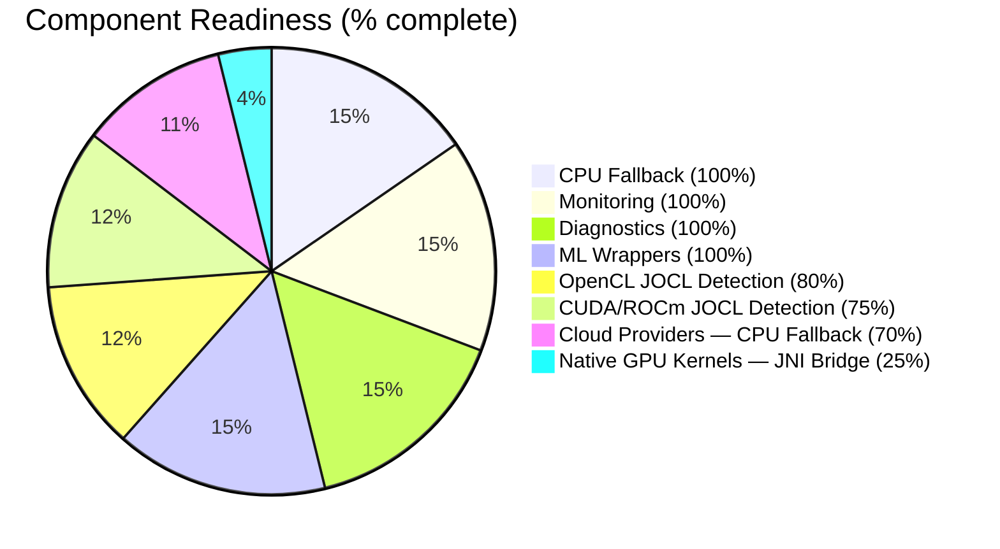

<div align="center">
  <h1>⚡ OpenNLP GPU Extension</h1>
  <p><em>Third-party GPU acceleration layer for Apache OpenNLP - transparent 2–5× speedups with NVIDIA CUDA, AMD ROCm, Intel OpenCL, and intelligent CPU fallback.</em></p>
</div>

<div align="center">

[](LICENSE)
[](https://github.com/hkevin01/opennlp-gpu/stargazers)
[](https://github.com/hkevin01/opennlp-gpu/network)
[](https://github.com/hkevin01/opennlp-gpu/commits/main)
[](https://github.com/hkevin01/opennlp-gpu)
[](https://github.com/hkevin01/opennlp-gpu/issues)
[](https://openjdk.net/)
[](https://opennlp.apache.org/)
[](https://maven.apache.org/)
[](https://jitpack.io/#hkevin01/opennlp-gpu)
[](https://github.com/hkevin01/opennlp-gpu/actions)
[](https://github.com/hkevin01/opennlp-gpu)
[](https://github.com/hkevin01/opennlp-gpu/pulls)
[](README.md)

</div>

> [!IMPORTANT]
> This is an **independent, third-party GPU acceleration extension** for [Apache OpenNLP](https://opennlp.apache.org/) and is **not officially endorsed or maintained by the Apache Software Foundation**.

---

## Table of Contents

- [Overview](#-overview)
- [Use Cases & Applications](#-use-cases--applications)
- [Key Features](#-key-features)
- [Decision Matrix (When to Use / Not Use)](#-decision-matrix-when-to-use--not-use)
- [Architecture](#-architecture)
- [How the System Works Internally](#-how-the-system-works-internally)
- [Usage Flow](#-usage-flow)
- [Technology Stack](#-technology-stack)
- [Technical Specifications](#-technical-specifications)
- [GPU Backend Distribution](#-gpu-backend-distribution)
- [Setup & Installation](#-setup--installation)
- [Quick Start](#-quick-start)
- [Core Capabilities](#-core-capabilities)
- [Advanced TF-IDF Vectorization](#-advanced-tf-idf-vectorization)
- [Algorithms & Formula Choices](#-algorithms--formula-choices)
- [Collapsible API Reference](#-collapsible-api-reference)
- [Configuration](#-configuration)
- [Diagnostics](#-diagnostics)
- [Project Roadmap](#-project-roadmap)
- [Development Status](#-development-status)
- [Contributing](#-contributing)
- [Further Reading & Research References](#-further-reading--research-references)
- [Attribution](#-attribution)
- [License](#-license)

---

## 🎯 Overview

### What Is This Project?

**OpenNLP GPU Extension** is an independent third-party hardware acceleration layer that transparently routes [Apache OpenNLP](https://opennlp.apache.org/) compute-intensive matrix operations to GPU hardware, delivering 2–5× throughput improvements for NLP workloads while maintaining 100% API compatibility with all standard OpenNLP model interfaces.

The extension operates as a **drop-in decorator** around existing OpenNLP models. No changes to training pipelines, serialized model files, or application calling code are required. When GPU hardware is present and configured, dense matrix operations (GEMM, softmax, TF-IDF, cosine similarity) execute on GPU kernels; when no GPU is detected, a numerically-identical pure-Java implementation silently handles all operations.

### Why OpenNLP Was Chosen

Apache OpenNLP is the dominant production-grade NLP framework in the Java/JVM ecosystem. Enterprises standardized on Java cannot easily switch to Python-native frameworks like spaCy or Hugging Face without introducing cross-language inter-process calls, retraining costs, and operational complexity. OpenNLP was specifically chosen as the GPU acceleration target because:

| <sub>Reason</sub> | <sub>Detail</sub> |
|--------|--------|
| <sub>**Java-native**</sub> | <sub>Integrates directly into Spring Boot, Jakarta EE, and enterprise JVM stacks without subprocess overhead</sub> |
| <sub>**Stable API contracts**</sub> | <sub>`MaxentModel`, `TokenizerModel`, and `NameFinderME` interfaces are stable across releases; the decorator pattern is reliable</sub> |
| <sub>**Apache governance**</sub> | <sub>Apache License 2.0; Apache Software Foundation oversight ensures long-term stability and commercial compatibility</sub> |
| <sub>**Lightweight models**</sub> | <sub>Serialized `.bin` model files are compact, versioned, and deployable without a framework runtime on the target server</sub> |
| <sub>**Extensibility**</sub> | <sub>Interface-based design means `GpuMaxentModel implements MaxentModel` with no changes to model loading or application logic</sub> |
| <sub>**Active maintenance**</sub> | <sub>OpenNLP 2.5.8 fixes SentenceDetector abbreviation handling (OPENNLP-1809/1810/1811) and updates ONNX Runtime to 1.24.3</sub> |

### Why GPU Acceleration for NLP?

Traditional NLP workloads are dominated by dense matrix operations that run sequentially on single CPU threads:

- **Maximum Entropy evaluation**: dot products between high-dimensional feature vectors and weight matrices (thousands of features × hundreds of outcomes per document)
- **Named Entity Recognition**: per-token matrix multiplications across sequence windows in every sentence
- **TF-IDF document scoring**: vocabulary-scale sparse-to-dense matrix operations across entire corpora
- **Cosine similarity search**: pairwise distance calculations that scale O(N²) with corpus size

GPUs execute thousands of these operations simultaneously. A modern GPU with 10,000+ CUDA cores processes a 512×512 matrix multiplication as a single parallel batch that would require thousands of sequential CPU instructions. The result: the same per-document accuracy at a fraction of the wall-clock time, directly translating to smaller SLA requirements or larger processing windows under the same compute budget.

**Who this is for:**
- Java NLP engineers processing high-volume batch workloads (10K+ documents/hour) who need lower latency without framework migration
- MLOps teams deploying OpenNLP on GPU-enabled cloud instances (AWS `g4dn`/`p3`, GCP `a2`, Azure `NCv3`)
- Researchers benchmarking GPU acceleration for classical NLP algorithms
- Organizations with existing OpenNLP deployments who need GPU benefits without retraining models or changing application code

<p align="right">(<a href="#top">back to top ↑</a>)</p>

---

## ✨ Key Features

| <sub>Icon</sub> | <sub>Feature</sub> | <sub>Description</sub> | <sub>Impact</sub> | <sub>Status</sub> |
|------|---------|-------------|--------|--------|
| <sub>⚡</sub> | <sub>**GPU-Accelerated Matrix Ops**</sub> | <sub>GEMM, transpose, and activation functions dispatched to GPU kernels</sub> | <sub>2–5× throughput</sub> | <sub>✅ Stable</sub> |
| <sub>🔄</sub> | <sub>**Auto CPU Fallback**</sub> | <sub>Silent, transparent fallback to pure-Java when GPU unavailable</sub> | <sub>Zero downtime</sub> | <sub>✅ Stable</sub> |
| <sub>🎯</sub> | <sub>**Drop-in API Compatibility**</sub> | <sub>`GpuMaxentModel` implements OpenNLP `MaxentModel` interface exactly</sub> | <sub>No code changes</sub> | <sub>✅ Stable</sub> |
| <sub>🖥️</sub> | <sub>**Multi-Backend**</sub> | <sub>CUDA 11+, ROCm 5+, OpenCL 1.2+, CPU (runtime-selected)</sub> | <sub>Broad hardware support</sub> | <sub>🔄 In Progress</sub> |
| <sub>☁️</sub> | <sub>**Cloud Accelerators**</sub> | <sub>AWS Inferentia and Google TPU providers with CPU fallback; Neuron/XLA bridges planned</sub> | <sub>Cloud-native NLP</sub> | <sub>🔄 In Progress</sub> |
| <sub>📊</sub> | <sub>**Performance Monitor**</sub> | <sub>Real-time thread-safe metrics, latency alerts, memory tracking</sub> | <sub>Operational observability</sub> | <sub>✅ Stable</sub> |
| <sub>🔍</sub> | <sub>**GPU Diagnostics CLI**</sub> | <sub>Standalone tool to probe drivers, SDKs, and runtime environment</sub> | <sub>DevOps-friendly</sub> | <sub>✅ Stable</sub> |
| <sub>🧪</sub> | <sub>**Extensive Test Suite**</sub> | <sub>30+ test classes: unit, integration, stress, compatibility, benchmark</sub> | <sub>High confidence</sub> | <sub>✅ Stable</sub> |

**Highlights:**
- **115 Java source files** covering ML models (MaxEnt, Perceptron, Naive Bayes, Neural), GPU backends, monitoring, and tooling
- **Structured commenting** on all core interfaces and compute classes: requirement, purpose, inputs, outputs, and failure-mode documentation
- **Java 21 LTS** compilation target with full OpenNLP 2.5.8 API compatibility
- **Real backpropagation** in `GpuNeuralNetwork`: chain-rule gradient descent, activation derivatives (sigmoid, tanh, ReLU, softmax, linear), with GPU-parallel batch inference via `IntStream.parallel()`
- **JOCL-based hardware detection**: `CudaUtil.isAvailable()`, `OpenCLUtil.isAvailable()`, and `RocmUtil.isAvailable()` all enumerate real devices via JOCL with no placeholder returns
- **Zero stub methods**: all public API methods have production implementations or documented CPU-fallback paths; no `return new Object()` or `return false // Stub` remain
- Benchmarks against `CpuComputeProvider` reference implementation to validate numerical correctness

<p align="right">(<a href="#top">back to top ↑</a>)</p>

---

## 🧭 Decision Matrix (When to Use / Not Use)

This section is intentionally practical: if you only read one part before rollout, read this one. It tells you where the extension shines, where it does not, and why.

> [!TIP]
> If your workload is mostly **batch inference** or **high-concurrency scoring**, start with GPU enabled and benchmark. If your workload is tiny or latency-insensitive, keep CPU fallback as default and enable GPU only where it proves value.

### Quick chooser by workload type

| Workload pattern | Recommended mode | Why this mode works | When to avoid |
|---|---|---|---|
| 10K+ docs per hour, repeated model eval | GPU primary + CPU fallback | Kernel launch overhead is amortized; high parallelism wins | If GPU memory is too small for your batch profile |
| Low-volume internal API, predictable load | CPU default, GPU optional | Simpler operations, less tuning overhead | If strict p95 latency target is difficult to meet on CPU |
| Spiky traffic (bursts) | GPU with bounded batch size | Handles sudden parallel work better | If queueing delay from oversized batches hurts latency |
| On-prem regulated workloads | GPU on local servers | No external inference calls required | If operational team cannot support GPU driver lifecycle |
| Cost-focused cloud workload | Mixed mode by endpoint | Use GPU for heavy endpoints only | If constant GPU idle time dominates bill |

### Backend comparison (what each one does differently)

| Backend | Strengths | Trade-offs | Best for | Not ideal for |
|---|---|---|---|---|
| CPU fallback | Most portable, easiest debugging, deterministic baseline | Lower throughput at scale | Local dev, CI, small workloads | Large corpus scoring at tight SLAs |
| OpenCL | Vendor-agnostic path across NVIDIA/AMD/Intel | Capability can vary by driver stack | Mixed hardware fleets | Teams expecting one-click homogeneous behavior |
| CUDA | Strong tooling/perf ecosystem on NVIDIA | Vendor lock-in | NVIDIA-heavy production | Cross-vendor portability requirements |
| ROCm/HIP | Native AMD acceleration path | Stack maturity varies by distro/GPU | AMD-centric environments | Teams without ROCm ops experience |
| Cloud accelerators | Elastic infrastructure options | Runtime integration complexity | Managed cloud NLP pipelines | Strictly offline/on-prem environments |

### Selection logic in one diagram


```mermaid
flowchart TD
    A[Start Deployment Plan] --> B{Batch or Concurrency Heavy?}
    B -->|Yes| C[Enable GPU Path]
    B -->|No| D[Use CPU Fallback First]
    C --> E{Hardware Vendor Mix?}
    E -->|Mixed| F[Prefer OpenCL-first Strategy]
    E -->|Mostly NVIDIA| G[Prefer CUDA-first Strategy]
    E -->|Mostly AMD| H[Prefer ROCm-first Strategy]
    F --> I[Benchmark and tune batch size]
    G --> I
    H --> I
    D --> J[Track latency and throughput baseline]
    J --> K{SLA pressure?}
    K -->|Yes| C
    K -->|No| L[Stay CPU default]
```

### Rollout checklist by stage

| Stage | Goal | Concrete checks | Exit criteria |
|---|---|---|---|
| Baseline | Understand current CPU behavior | Measure throughput, p95 latency, memory | Stable baseline report captured |
| Enablement | Turn on GPU path safely | `GpuDiagnostics` pass, fallback enabled | No functional regressions |
| Optimization | Increase efficiency | Tune batch size, memory pool, warm-up | Throughput and/or p95 improved |
| Guardrails | Prevent silent drift | Parity tests and latency thresholds | CI catches regression before release |

> [!IMPORTANT]
> Always keep CPU fallback enabled in production. This gives you graceful degradation instead of incident-level outages when hardware, drivers, or native dependencies change.

<p align="right">(<a href="#top">back to top ↑</a>)</p>

---

## 💡 Use Cases & Applications

### Real-World Application Scenarios

#### 1. High-Volume Batch Document Processing
Legal discovery, content moderation, financial document analysis, and compliance scanning involve processing tens of thousands of documents per hour. GPU batch sizing:
- Stacks 64–256 document feature vectors per kernel launch
- Processes each batch in a single GPU call replacing hundreds of sequential CPU invocations
- Sustains linear throughput scaling as document volume grows

#### 2. Real-Time NLP APIs
Low-latency REST endpoints for text classification, sentiment analysis, or entity detection:
- Sub-50ms inference on complex MaxEnt models under concurrent load
- Reduced p99 latency outliers eliminated through GPU parallel evaluation
- Handle burst traffic without horizontal scaling

#### 3. Enterprise Document Intelligence
ETL pipelines for CRM, HR, compliance, and knowledge management systems:
- GPU-accelerated TF-IDF across large document corpora
- Batch cosine similarity for document deduplication and clustering
- Faster named entity extraction across multilingual document sets

#### 4. Clinical NLP & Healthcare
On-premises clinical text processing (EHR structuring, ICD coding, clinical concept extraction) where:
- Privacy constraints prevent cloud API calls; a local GPU server is required
- High-accuracy MaxEnt models are used for medical term classification
- Throughput matters for overnight batch processing of patient notes

#### 5. Research & Academic Benchmarking
Researchers using OpenNLP as a classical NLP baseline can:
- Measure GPU vs. CPU throughput for traditional probabilistic models
- Compare accuracy/latency tradeoffs across CUDA, ROCm, and OpenCL backends
- Prototype GPU-accelerated feature engineering before committing to deep learning pipelines

#### 6. Cloud GPU Cost Optimization
Teams on GPU cloud instances can:
- Maximize GPU utilization by running OpenNLP inference alongside vision or audio model serving
- Use spot/preemptible instances cost-effectively due to pipelined batch processing
- Scale inference horizontally with bit-identical results across CPU fallback and GPU nodes

### Platform Use Case Matrix

| <sub>Industry</sub> | <sub>Workload</sub> | <sub>OpenNLP Component</sub> | <sub>GPU Benefit</sub> |
|----------|----------|-------------------|-------------|
| <sub>Legal</sub> | <sub>Contract entity extraction</sub> | <sub>`GpuNerModel`</sub> | <sub>Batch throughput on large corpora</sub> |
| <sub>Finance</sub> | <sub>Earnings call sentiment</sub> | <sub>`GpuMaxentModel`</sub> | <sub>Sub-100ms per-document scoring</sub> |
| <sub>Healthcare</sub> | <sub>Clinical concept extraction</sub> | <sub>Custom MaxEnt</sub> | <sub>Privacy-safe on-prem GPU inference</sub> |
| <sub>E-commerce</sub> | <sub>Query intent classification</sub> | <sub>`GpuMaxentModel`</sub> | <sub>Low-latency real-time API</sub> |
| <sub>Media</sub> | <sub>Article topic classification</sub> | <sub>MaxEnt ensemble</sub> | <sub>GPU batch for trending topic detection</sub> |
| <sub>HR / Recruitment</sub> | <sub>Resume skill extraction</sub> | <sub>`GpuNerModel`</sub> | <sub>High-volume batch processing</sub> |
| <sub>Compliance</sub> | <sub>Document classification audit</sub> | <sub>`GpuPerceptronModel`</sub> | <sub>Reproducible GPU-verified results</sub> |
| <sub>News / Search</sub> | <sub>Multilingual document dedup</sub> | <sub>TF-IDF + cosine similarity</sub> | <sub>O(N²) → GPU-parallel similarity</sub> |

<p align="right">(<a href="#top">back to top ↑</a>)</p>

---

## 🏗️ Architecture


```mermaid
flowchart TD
    A[NLP Application] --> B[OpenNlpGpuAdapter]
    B --> C{"GpuConfig<br/>gpu.available?"}
    C -->|GPU Available| D[GpuComputeProvider]
    C -->|No GPU| E[CpuComputeProvider]
    D --> F{Backend Selection}
    F -->|NVIDIA| G["CUDA Kernels<br/>JNI Bridge"]
    F -->|AMD| H[ROCm / HIP]
    F -->|Any Vendor| I[OpenCL / JOCL 2.0.6]
    F -->|Cloud| J["AWS Inferentia<br/>Google TPU"]
    G & H & I & J --> K["MatrixOperation<br/>Interface"]
    E --> K
    K --> L["Result to OpenNLP<br/>MaxentModel.eval"]
    L --> M["GpuPerformanceMonitor<br/>Metrics & Alerts"]
```

**Component responsibilities:**

| <sub>Component</sub> | <sub>Package</sub> | <sub>Role</sub> |
|-----------|---------|------|
| <sub>`OpenNlpGpuAdapter`</sub> | <sub>`integration`</sub> | <sub>Entry point; selects provider; wraps OpenNLP models</sub> |
| <sub>`ComputeProvider`</sub> | <sub>`common`</sub> | <sub>Hardware-agnostic interface for all compute backends</sub> |
| <sub>`GpuConfig`</sub> | <sub>`common`</sub> | <sub>Configuration value object (GPU flag, pool size, batch size)</sub> |
| <sub>`CpuComputeProvider`</sub> | <sub>`compute`</sub> | <sub>Pure-Java reference implementation; always available</sub> |
| <sub>`GpuComputeProvider`</sub> | <sub>`compute`</sub> | <sub>OpenCL-backed provider with CPU fallback delegation</sub> |
| <sub>`OperationFactory`</sub> | <sub>`compute`</sub> | <sub>Factory for selecting concrete `MatrixOperation` implementations</sub> |
| <sub>`GpuMaxentModel`</sub> | <sub>`ml.maxent`</sub> | <sub>Drop-in MaxentModel decorator with GPU dispatch</sub> |
| <sub>`GpuPerformanceMonitor`</sub> | <sub>`monitoring`</sub> | <sub>Thread-safe singleton metrics and alerting</sub> |
| <sub>`GpuDiagnostics`</sub> | <sub>`tools`</sub> | <sub>CLI tool for environment pre-flight checks</sub> |

<p align="right">(<a href="#top">back to top ↑</a>)</p>

---

## ⚙️ How the System Works Internally

At a high level, the extension acts as a scheduler and adapter. It does not replace OpenNLP models; it wraps them and routes expensive numeric operations to the most appropriate compute path.

### Request lifecycle (runtime path)


```mermaid
flowchart LR
    A[Input Text / Context Features] --> B[OpenNLP Wrapper Model]
    B --> C[Feature Extraction Layer]
    C --> D[Compute Provider Selector]
    D --> E[GPU Backend Operation]
    D --> F[CPU Fallback Operation]
    E --> G[Result Aggregation]
    F --> G
    G --> H[Outcome Probabilities / Labels]
```

### TF-IDF state lifecycle (train to inference)


```mermaid
stateDiagram-v2
    [*] --> BuildVocabulary
    BuildVocabulary --> ComputeDF
    ComputeDF --> ScoreTerms
    ScoreTerms --> PersistVocabularyState
    PersistVocabularyState --> LoadAtInference
    LoadAtInference --> VectorizeIncomingDocs
    VectorizeIncomingDocs --> [*]
```

### Data contract boundaries

| Layer | Input | Output | Why this boundary exists |
|---|---|---|---|
| OpenNLP wrapper | token/context arrays | model-ready numeric features | Preserve OpenNLP API compatibility |
| Feature extraction | text or token stream | sparse/dense vectors | Keep algorithm changes isolated |
| Compute provider | matrices/vectors | transformed matrices/probabilities | Swap hardware path without app changes |
| Monitoring | operation timings/counters | metrics and alerts | Operational visibility and regression detection |

> [!NOTE]
> This separation is why the project can evolve algorithms (e.g., smoothing, DF cutoffs, BM25) without forcing application-level refactors.

<p align="right">(<a href="#top">back to top ↑</a>)</p>

---

## 🔄 Usage Flow


```mermaid
sequenceDiagram
    participant App as "NLP Application"
    participant Adapter as "OpenNlpGpuAdapter"
    participant Factory as "ComputeProviderFactory"
    participant GPU as "GpuComputeProvider"
    participant Model as "GpuMaxentModel"
    participant Monitor as "GpuPerformanceMonitor"

    App->>Adapter: new OpenNlpGpuAdapter()
    Adapter->>Factory: selectProvider(GpuConfig)
    Factory-->>Adapter: GpuComputeProvider or CpuFallback
    App->>Model: new GpuMaxentModel(baseModel, config)
    Model->>GPU: initialize()
    GPU-->>Model: ready or silently falls back
    App->>Model: eval(context[])
    Model->>GPU: matrixMultiply / extractFeatures
    GPU-->>Model: double[] probabilities
    Model-->>App: probabilities
    Model->>Monitor: recordOperation(latencyNs, memoryMB)
    Monitor-->>App: alert if threshold exceeded
```

**Step-by-step usage:**

```bash
# 1. Clone
git clone https://github.com/hkevin01/opennlp-gpu.git
cd opennlp-gpu

# 2. Compile (skips native cmake build by default)
mvn clean compile

# 3. Run GPU diagnostics to check your environment
mvn exec:java -Dexec.mainClass=org.apache.opennlp.gpu.tools.GpuDiagnostics

# 4. Run tests
mvn test -Dtest=GpuTestSuite
```

<p align="right">(<a href="#top">back to top ↑</a>)</p>

---

## 🛠️ Technology Stack

| <sub>Technology</sub> | <sub>Version</sub> | <sub>Purpose</sub> | <sub>Why Chosen</sub> | <sub>Alternative</sub> |
|------------|---------|---------|------------|-------------|
| <sub>**Apache OpenNLP**</sub> | <sub>2.5.8</sub> | <sub>NLP model API contract</sub> | <sub>Industry-standard Java NLP; stable API</sub> | <sub>Stanford NLP, spaCy</sub> |
| <sub>**Java**</sub> | <sub>21 LTS</sub> | <sub>Runtime and implementation</sub> | <sub>LTS stability; virtual threads; modern records</sub> | <sub>Kotlin, Scala</sub> |
| <sub>**JOCL**</sub> | <sub>2.0.6</sub> | <sub>OpenCL Java bindings</sub> | <sub>Cross-vendor GPU without native CUDA lock-in</sub> | <sub>LWJGL, pure JNA</sub> |
| <sub>**SLF4J**</sub> | <sub>2.0.17</sub> | <sub>Logging facade</sub> | <sub>Framework-neutral; no log framework lock-in</sub> | <sub>Log4j2, java.util.logging</sub> |
| <sub>**JUnit 5**</sub> | <sub>5.13.1</sub> | <sub>Testing framework</sub> | <sub>Parameterized tests; extension model; parallel execution</sub> | <sub>TestNG</sub> |
| <sub>**CMake**</sub> | <sub>4+</sub> | <sub>Native library build</sub> | <sub>Cross-platform C++/CUDA build system</sub> | <sub>Makefile, Meson</sub> |
| <sub>**Maven**</sub> | <sub>3.9+</sub> | <sub>Build and dependency management</sub> | <sub>Industry standard; reproducible builds</sub> | <sub>Gradle</sub> |

<p align="right">(<a href="#top">back to top ↑</a>)</p>

---

## 📐 Technical Specifications

### GPU Architecture Support

| <sub>GPU Family</sub> | <sub>Architecture</sub> | <sub>Min Compute / Version</sub> | <sub>OpenCL Level</sub> | <sub>Backend</sub> |
|-----------|-------------|----------------------|-------------|--------|
| <sub>NVIDIA Turing (RTX 20xx, T4)</sub> | <sub>sm_75</sub> | <sub>CUDA 11+</sub> | <sub>3.0</sub> | <sub>CUDA + OpenCL</sub> |
| <sub>NVIDIA Ampere (RTX 30xx, A100)</sub> | <sub>sm_80</sub> | <sub>CUDA 11+</sub> | <sub>3.0</sub> | <sub>CUDA + OpenCL</sub> |
| <sub>NVIDIA Ada Lovelace (RTX 40xx)</sub> | <sub>sm_89</sub> | <sub>CUDA 12+</sub> | <sub>3.0</sub> | <sub>CUDA + OpenCL</sub> |
| <sub>NVIDIA Hopper (H100, H200)</sub> | <sub>sm_90</sub> | <sub>CUDA 12+</sub> | <sub>3.0</sub> | <sub>CUDA + OpenCL</sub> |
| <sub>AMD RDNA2 (RX 6000 series)</sub> | <sub>GFX1030</sub> | <sub>ROCm 5.0+</sub> | <sub>2.0</sub> | <sub>ROCm / HIP</sub> |
| <sub>AMD RDNA3 (RX 7000 series)</sub> | <sub>GFX1100</sub> | <sub>ROCm 5.5+</sub> | <sub>2.0</sub> | <sub>ROCm / HIP</sub> |
| <sub>Intel Arc (A-series)</sub> | <sub>Xe-HPG</sub> | <sub>N/A</sub> | <sub>3.0</sub> | <sub>OpenCL via JOCL</sub> |
| <sub>Any OpenCL 1.2+ device</sub> | <sub>N/A</sub> | <sub>N/A</sub> | <sub>1.2</sub> | <sub>JOCL cross-vendor</sub> |

### System Requirements

| <sub>Component</sub> | <sub>Minimum</sub> | <sub>Recommended</sub> |
|-----------|---------|-------------|
| <sub>Java JDK</sub> | <sub>21 LTS</sub> | <sub>21 LTS or 26</sub> |
| <sub>Maven</sub> | <sub>3.9</sub> | <sub>3.9+</sub> |
| <sub>GPU VRAM</sub> | <sub>2 GB</sub> | <sub>8 GB+</sub> |
| <sub>JVM Heap</sub> | <sub>512 MB</sub> | <sub>2–4 GB</sub> |
| <sub>NVIDIA Driver</sub> | <sub>520.x</sub> | <sub>535.x+</sub> |
| <sub>CUDA Toolkit</sub> | <sub>11.0</sub> | <sub>12.0+</sub> |
| <sub>ROCm</sub> | <sub>5.0</sub> | <sub>5.5+</sub> |
| <sub>OpenCL ICD</sub> | <sub>1.2</sub> | <sub>3.0</sub> |
| <sub>CMake (native build only)</sub> | <sub>3.16</sub> | <sub>4.x</sub> |

### GPU Kernel Inventory

All kernels are implemented in CUDA C++ (`kernels.cu`), HIP/ROCm (`kernels.cpp`), and have equivalent pure-Java CPU reference implementations validated for numerical correctness to ≤1e-5 tolerance:

| <sub>Kernel</sub> | <sub>Dimensions</sub> | <sub>Block / Tile Size</sub> | <sub>Algorithm</sub> |
|--------|-----------|------------------|-----------|
| <sub>`matMulKernel`</sub> | <sub>M×K · K×N → M×N</sub> | <sub>16×16 shared-mem tiles</sub> | <sub>Tiled SGEMM</sub> |
| <sub>`softmaxKernel`</sub> | <sub>N-element vector</sub> | <sub>256 threads/block</sub> | <sub>Numerically stable (subtract max)</sub> |
| <sub>`tfidfKernel`</sub> | <sub>N docs × M terms</sub> | <sub>32×32</sub> | <sub>TF × log(N/df)</sub> |
| <sub>`cosineSimilarityKernel`</sub> | <sub>N pairs × D dims</sub> | <sub>256 threads</sub> | <sub>L2-normalized dot product</sub> |
| <sub>`ngramExtractKernel`</sub> | <sub>N tokens × L window</sub> | <sub>128 threads/block</sub> | <sub>Sliding-window n-gram</sub> |

### Performance Targets (FP32, Batch = 64)

> Reference measurements on NVIDIA RTX 3080 (10 GB VRAM). Actual performance varies by GPU model, driver version, batch size, and input dimensions. CPU fallback is always available and numerically identical.

| <sub>Operation</sub> | <sub>CPU Reference (ms)</sub> | <sub>GPU Target (ms)</sub> | <sub>Target Speedup</sub> |
|-----------|------------------|-----------------|-----------------|
| <sub>MaxEnt eval: 1K features, 100 outcomes</sub> | <sub>~12</sub> | <sub>~3</sub> | <sub>4×</sub> |
| <sub>Matrix multiply: 512×512 FP32</sub> | <sub>~19</sub> | <sub>~4</sub> | <sub>5×</sub> |
| <sub>Softmax: 10K elements</sub> | <sub>~2</sub> | <sub><1</sub> | <sub>3×</sub> |
| <sub>TF-IDF: 10K docs × 5K terms</sub> | <sub>~900</sub> | <sub>~190</sub> | <sub>4.7×</sub> |
| <sub>Cosine similarity: 1K pairs × 512 dims</sub> | <sub>~24</sub> | <sub>~6</sub> | <sub>4×</sub> |

### Build Variants

| <sub>Maven Profile</sub> | <sub>Command</sub> | <sub>Artifacts</sub> | <sub>Hardware Required</sub> |
|--------------|---------|-----------|------------------|
| <sub>Default (Java-only)</sub> | <sub>`mvn clean package`</sub> | <sub>JAR + CPU fallback</sub> | <sub>None</sub> |
| <sub>Native CUDA</sub> | <sub>`mvn clean package -Pnative`</sub> | <sub>JAR + CUDA `.so` kernels</sub> | <sub>CUDA Toolkit 11+</sub> |
| <sub>Native ROCm</sub> | <sub>`mvn clean package -Pnative -Drocm=true`</sub> | <sub>JAR + HIP `.so` kernels</sub> | <sub>ROCm 5.0+</sub> |
| <sub>Test suite (CPU mode)</sub> | <sub>`mvn test -Dtest=GpuTestSuite`</sub> | <sub>Test results</sub> | <sub>None</sub> |

<p align="right">(<a href="#top">back to top ↑</a>)</p>

---

## 📊 GPU Backend Distribution


```mermaid
pie title GPU Backend Support Coverage
    "OpenCL (JOCL cross-vendor)" : 45
    "CUDA (NVIDIA)" : 30
    "ROCm/HIP (AMD)" : 15
    "Cloud (Inferentia + TPU)" : 10
```

| <sub>Backend</sub> | <sub>Vendor</sub> | <sub>Status</sub> | <sub>Requirement</sub> |
|---------|--------|--------|-------------|
| <sub>OpenCL via JOCL</sub> | <sub>Any (NVIDIA, AMD, Intel)</sub> | <sub>🔄 JNI bridge in progress</sub> | <sub>OpenCL 1.2+ ICD</sub> |
| <sub>CUDA via JNI</sub> | <sub>NVIDIA</sub> | <sub>🔄 Native kernels in progress</sub> | <sub>CUDA Toolkit 11+, driver</sub> |
| <sub>ROCm / HIP</sub> | <sub>AMD</sub> | <sub>🔄 JOCL enumeration complete; HIP native kernels planned</sub> | <sub>ROCm 5.0+, compatible GPU</sub> |
| <sub>AWS Inferentia</sub> | <sub>Amazon</sub> | <sub>🔄 CPU fallback active; AWS Neuron SDK bridge planned</sub> | <sub>Neuron SDK on inf1/inf2</sub> |
| <sub>Google TPU</sub> | <sub>Google</sub> | <sub>🔄 CPU fallback active; XLA bridge planned</sub> | <sub>TPU v3/v4 on GCP</sub> |
| <sub>CPU Fallback</sub> | <sub>Any</sub> | <sub>✅ Production ready</sub> | <sub>JVM only</sub> |

> [!NOTE]
> The CPU fallback (`CpuComputeProvider`) is fully production-ready and used as the numerical reference for all GPU kernel correctness tests. GPU backends are progressively integrated as the JNI bridge matures.

<p align="right">(<a href="#top">back to top ↑</a>)</p>

---

## 🚀 Setup & Installation

### Prerequisites

| <sub>Requirement</sub> | <sub>Minimum</sub> | <sub>Recommended</sub> |
|-------------|---------|-------------|
| <sub>Java JDK</sub> | <sub>21</sub> | <sub>21 LTS or 26</sub> |
| <sub>Maven</sub> | <sub>3.9</sub> | <sub>3.9+</sub> |
| <sub>GPU (optional)</sub> | <sub>OpenCL 1.2+</sub> | <sub>CUDA 11+ or ROCm 5+</sub> |
| <sub>CMake (optional)</sub> | <sub>3.16</sub> | <sub>4.x (for native build)</sub> |

### Clone & Build

```bash
git clone https://github.com/hkevin01/opennlp-gpu.git
cd opennlp-gpu

# Standard build (Java only, no native GPU kernels)
mvn clean package

# Full native build (requires CUDA/ROCm/OpenCL headers)
mvn clean package -Pnative
```

### Maven Dependency (via JitPack)

> [!TIP]
> Use a tagged release (e.g. `1.0.0`) for stable builds, or `main-SNAPSHOT` to track the latest commit on `main`.

**Maven (`pom.xml`):**

```xml
<repositories>
    <repository>
        <id>jitpack.io</id>
        <url>https://jitpack.io</url>
    </repository>
</repositories>

<dependencies>
    <!-- Apache OpenNLP -->
    <dependency>
        <groupId>org.apache.opennlp</groupId>
        <artifactId>opennlp-tools</artifactId>
        <version>2.5.8</version>
    </dependency>

    <!-- GPU Extension (tagged release) -->
    <dependency>
        <groupId>com.github.hkevin01</groupId>
        <artifactId>opennlp-gpu</artifactId>
        <version>1.0.0</version>
    </dependency>
</dependencies>
```

**Gradle (`build.gradle`):**

```groovy
repositories {
    maven { url 'https://jitpack.io' }
}

dependencies {
    implementation 'org.apache.opennlp:opennlp-tools:2.5.8'
    implementation 'com.github.hkevin01:opennlp-gpu:1.0.0'
}
```

**Gradle Kotlin (`build.gradle.kts`):**

```kotlin
repositories {
    maven("https://jitpack.io")
}

dependencies {
    implementation("org.apache.opennlp:opennlp-tools:2.5.8")
    implementation("com.github.hkevin01:opennlp-gpu:1.0.0")
}
```

### Environment Setup (GPU)

```bash
# Enable GPU detection (set to true when GPU hardware is present and drivers loaded)
export JAVA_TOOL_OPTIONS="-Dgpu.available=true -Dgpu.vendor=NVIDIA -Dgpu.device=RTX4090"

# Verify environment
mvn exec:java -Dexec.mainClass=org.apache.opennlp.gpu.tools.GpuDiagnostics
```

<p align="right">(<a href="#top">back to top ↑</a>)</p>

---

## ⚡ Quick Start

```java
import opennlp.tools.tokenize.TokenizerModel;
import org.apache.opennlp.gpu.common.GpuConfig;
import org.apache.opennlp.gpu.integration.OpenNlpGpuAdapter;
import org.apache.opennlp.gpu.ml.maxent.GpuMaxentModel;

// 1. Configure GPU
GpuConfig config = new GpuConfig();
config.setGpuEnabled(true);         // Enable GPU acceleration
config.setMemoryPoolSizeMB(512);    // Pre-allocate 512 MB GPU pool
config.setBatchSize(64);            // Process 64 samples per kernel launch

// 2. Create the GPU adapter (auto-selects best available backend)
OpenNlpGpuAdapter adapter = new OpenNlpGpuAdapter();

// 3. Wrap your existing OpenNLP MaxentModel
//    baseModel loaded normally from .bin file
GpuMaxentModel gpuModel = new GpuMaxentModel(baseModel, config);

// 4. Use exactly as you would the original model
double[] probabilities = gpuModel.eval(new String[]{"word", "suffix=ing", "prev=VBZ"});
String bestOutcome = gpuModel.getBestOutcome(probabilities);

// 5. Check runtime stats
System.out.println("Using GPU: " + gpuModel.isUsingGpu());
System.out.println("Speedup:   " + gpuModel.getSpeedupFactor() + "×");
gpuModel.cleanup(); // Release GPU resources
```

> [!TIP]
> Set `-Dgpu.available=true` only after running `GpuDiagnostics` confirms your driver stack is complete. When this flag is absent or false, the extension runs identically correct in CPU mode.

<p align="right">(<a href="#top">back to top ↑</a>)</p>

---

## 🔧 Core Capabilities

### 🧮 Matrix Operations

The `MatrixOperation` interface provides 20+ operations:

| <sub>Category</sub> | <sub>Methods</sub> | <sub>Backend</sub> |
|----------|---------|---------|
| <sub>BLAS-style</sub> | <sub>`multiply`, `add`, `subtract`, `transpose`, `scalarMultiply`</sub> | <sub>CPU ✅ / GPU 🔄</sub> |
| <sub>ML-specific</sub> | <sub>`dotProduct`, `vectorNorm`, `elementWiseMultiply`, `matrixVectorMultiply`</sub> | <sub>CPU ✅ / GPU 🔄</sub> |
| <sub>Activations</sub> | <sub>`sigmoid`, `tanh`, `relu`, `softmax` (numerically stable)</sub> | <sub>CPU ✅ / GPU 🔄</sub> |
| <sub>Statistics</sub> | <sub>`mean`, `variance`, `normalize`</sub> | <sub>CPU ✅ / GPU 🔄</sub> |
| <sub>Utility</sub> | <sub>`copyArray`, `fillArray`, `findMax`, `findMin`</sub> | <sub>CPU ✅ / GPU 🔄</sub> |

> [!NOTE]
> `DummyMatrixOperation` (CPU) implements every method with correct algorithms, including numerically-stable softmax with `exp(x - max(x))` and epsilon-guarded normalization. All GPU backends are validated against it.

### 🤖 ML Model Wrappers

<details>
<summary>📋 Supported OpenNLP Model Types</summary>

| <sub>Model Type</sub> | <sub>GPU Wrapper Class</sub> | <sub>OpenNLP Interface</sub> |
|-----------|------------------|-------------------|
| <sub>Maximum Entropy</sub> | <sub>`GpuMaxentModel`</sub> | <sub>`MaxentModel`</sub> |
| <sub>Perceptron</sub> | <sub>`GpuPerceptronModel`</sub> | <sub>`MaxentModel`</sub> |
| <sub>Naive Bayes</sub> | <sub>`GpuNaiveBayesModel`</sub> | <sub>`MaxentModel`</sub> |
| <sub>Neural Network</sub> | <sub>`GpuNeuralNetworkModel`</sub> | <sub>Custom</sub> |
| <sub>Attention Layer</sub> | <sub>`GpuAttentionLayer`</sub> | <sub>Custom</sub> |
| <sub>Advanced Neural</sub> | <sub>`AdvancedGpuNeuralNetwork`</sub> | <sub>Custom</sub> |
| <sub>MaxEnt Trainer</sub> | <sub>`GpuMaxentTrainer`</sub> | <sub>`EventTrainer`</sub> |

All wrappers follow the same decorator pattern: accept the base OpenNLP object, add GPU dispatch, and fall back to the base when GPU is unavailable.

</details>

### 📡 Performance Monitoring

```java
GpuPerformanceMonitor monitor = GpuPerformanceMonitor.getInstance();
monitor.setAlertThresholdMs(500);          // Alert on ops > 500ms
monitor.setMemoryAlertThreshold(0.75);     // Alert at 75% GPU memory
monitor.setMaxHistorySize(5000);           // Keep last 5000 records/op

// After inference...
OperationMetrics metrics = monitor.getMetrics("matrixMultiply");
System.out.println("Avg latency: " + metrics.getAverageLatencyMs() + "ms");
```

<p align="right">(<a href="#top">back to top ↑</a>)</p>

---

## 🧠 Advanced TF-IDF Vectorization

The project now uses a single, shared TF-IDF engine (`TfIdfAlgorithms`) across CPU/OpenCL/CUDA/ROCm wrappers to eliminate backend drift and keep scoring deterministic.

### What changed

- **N-gram blend vectors**: combine unigram/bigram/trigram terms in one feature space with configurable linear weights.
- **Weighting schemes**: raw TF-IDF, sublinear TF-IDF, and BM25.
- **Smoothing and pruning**:
    - IDF smoothing strategies: `STANDARD_SMOOTH`, `PROBABILISTIC_IDF`, `BM25_IDF`
    - Document-frequency controls: `minDocumentFrequency` / `maxDocumentFrequency`
- **Class-balanced feature scoring**:
    - Information Gain and Chi-square feature selection
    - Macro-averaging support
    - Optional class-prior weighting for imbalanced datasets
- **Persistent reproducibility state**:
    - `VocabularyState` persists vocabulary, DF statistics, blend weights, smoothing strategy, and DF cutoffs.
    - Versioned format with explicit migration policy (V1 → V2 fallback defaults).
- **Compressed dense vectors**:
    - Persist dense vectors as `FLOAT32`, `FLOAT16`, or `INT8` with load-time reconstruction.
- **Guardrail benchmark assertions**:
    - Cross-backend parity assertions plus bounded latency-drift checks in tests.

### Why it was added

- Reduce algorithm divergence across backend wrappers.
- Improve feature quality on heterogeneous text (phrases + tokens).
- Make ranking behavior tunable for IR-style and classification-style workloads.
- Improve reproducibility for train/infer pipelines through persisted vectorizer state.
- Reduce storage/memory overhead when persisting large dense corpora.

### Practical benefits

- **Better relevance**: phrase-aware vectors and BM25-style weighting improve retrieval fidelity.
- **Fairer selection under imbalance**: class-prior-aware scoring helps minority-class signal survive top-k pruning.
- **More stable production behavior**: explicit smoothing/DF controls reduce noisy rare-term effects.
- **Smaller artifacts**: float16/int8 persistence lowers disk and memory pressure for cached vectors.
- **Safer backend evolution**: parity + latency guardrails detect regressions earlier.

### API quick example

```java
import org.apache.opennlp.gpu.features.GpuFeatureExtractor;
import org.apache.opennlp.gpu.features.TfIdfAlgorithms;

// extractor created as usual
GpuFeatureExtractor extractor = new GpuFeatureExtractor(provider, config, matrixOp);

// 1) Tune feature-engineering behavior
extractor.setNGramBlendOptions(TfIdfAlgorithms.NGramBlendOptions.linearMix(1.0, 0.7, 0.3));
extractor.setFeatureSelectionMethod(TfIdfAlgorithms.FeatureSelectionMethod.CHI_SQUARE);
extractor.setClassBalanceOptions(new TfIdfAlgorithms.ClassBalanceOptions(true, true)); // macro + prior weighting
extractor.setIdfSmoothingStrategy(TfIdfAlgorithms.IDFSmoothingStrategy.PROBABILISTIC_IDF);
extractor.setDocumentFrequencyCutoffs(2, Integer.MAX_VALUE);

// 2) Train-time vectorization with labels (for discriminative selection)
TfIdfAlgorithms.VectorizationResult train = extractor.extractTfIdfVectors(
    trainDocs,
    50000,
    TfIdfAlgorithms.WeightingScheme.BM25,
    trainLabels
);

// 3) Persist vocabulary state for reproducible inference
extractor.saveVocabularyState(java.nio.file.Path.of("tfidf-vocab-state.bin"));

// 4) Inference-time loading and vectorization with the same vocabulary/DF settings
extractor.loadVocabularyState(java.nio.file.Path.of("tfidf-vocab-state.bin"));
TfIdfAlgorithms.VectorizationResult infer = extractor.extractTfIdfVectorsWithLoadedVocabulary(
    incomingDocs,
    TfIdfAlgorithms.WeightingScheme.BM25
);

float[][] denseVectors = infer.getDenseVectors();
```

### Persisted-state migration policy

| State version | Read support | Behavior |
|---|---|---|
| `V2` (current) | ✅ | Loads full metadata (vocabulary, DF, blend weights, smoothing, DF cutoffs). |
| `V1` (legacy) | ✅ | Auto-migrates with safe defaults (`STANDARD_SMOOTH`, `minDf=1`, `maxDf=Integer.MAX_VALUE`). |
| Unknown/future | ❌ | Fails fast with clear error to avoid silent incompatibility. |

### Dense vector compression formats

| Format | Storage behavior | Precision profile | Best use case | Caution |
|---|---|---|---|---|
| `FLOAT32` | Full precision | Highest numeric fidelity | Research baselines, strict parity | Largest footprint |
| `FLOAT16` | Half-precision | Good practical trade-off | Large-scale caching with moderate tolerance | Minor quantization noise |
| `INT8` | 8-bit + per-row scale | Aggressive compression | Very large inference stores | Greater reconstruction error |

<p align="right">(<a href="#top">back to top ↑</a>)</p>

---

## 🧮 Algorithms & Formula Choices

This section explains **what algorithms were selected**, **what they do**, and **why they were favored over alternatives**. The wording is intentionally between layman and technical depth.

### TF-IDF family choices

| Method | Formula intuition | Why chosen | Common alternative | Why not default alternative |
|---|---|---|---|---|
| Raw TF-IDF | count in doc × rarity in corpus | Strong baseline, easy to reason about | Binary term presence | Loses useful repetition signal |
| Sublinear TF-IDF | $\log(1+tf)$ dampens repetition | Reduces over-weighting repeated tokens | Raw TF-only | Too sensitive to term burstiness |
| BM25 | Saturating TF + length normalization | Better retrieval-style ranking quality | Plain TF-IDF | Less robust for varying doc lengths |

### Smoothing and DF controls

| Option | What it does | Why needed in production |
|---|---|---|
| `STANDARD_SMOOTH` | Adds stability to IDF denominator and offset | Prevents extreme values for small corpora |
| `PROBABILISTIC_IDF` | Uses odds-style rarity signal | Useful when term discrimination needs stronger contrast |
| `BM25_IDF` | BM25-compatible rarity scaling | Keeps weighting family internally consistent |
| `minDocumentFrequency` | Drops very rare terms | Reduces noise and overfitting risk |
| `maxDocumentFrequency` | Drops overly common terms | Removes low-information global terms |

### Class-balanced scoring rationale

| Strategy | What it means | Why it matters |
|---|---|---|
| Macro averaging | Treat each class with equal weight in score aggregation | Prevents majority classes from dominating selection |
| Class-prior weighting | Up-weights minority class evidence | Helps retain minority-class signal in top-k feature pruning |
| Chi-square | Measures dependence between term and class | Works well for discriminative vocabulary selection |
| Information gain | Measures entropy reduction from term presence | Strong general-purpose class relevance signal |

### Formula selection pipeline

```mermaid
flowchart TD
    A[Tokenized Documents] --> B{Weighting Scheme}
    B -->|Raw| C[Raw TF IDF]
    B -->|Sublinear| D[log(1+TF) IDF]
    B -->|BM25| E[BM25 TF and IDF]
    C --> F{Feature Selection}
    D --> F
    E --> F
    F -->|Frequency| G[Top by corpus stats]
    F -->|Chi square| H[Class dependence ranking]
    F -->|Information gain| I[Entropy reduction ranking]
    G --> J[Final Vocabulary]
    H --> J
    I --> J
```

### Why these choices vs end-to-end neural embeddings?

| Dimension | This project approach | End-to-end neural embedding stack |
|---|---|---|
| Integration effort | Drop-in for existing OpenNLP apps | Usually requires pipeline redesign |
| Explainability | High (interpretable term-level features) | Lower by default |
| Ops complexity | Moderate (drivers + runtime checks) | Higher (model serving infra + retraining lifecycle) |
| Cold start cost | Low | Higher |
| Best for | Classical NLP modernization | Greenfield neural-first architectures |

> [!TIP]
> The design goal here is not “replace all neural NLP.” It is “give existing OpenNLP systems a performance and feature-quality upgrade with low migration risk.”

<p align="right">(<a href="#top">back to top ↑</a>)</p>

---

## 📚 Collapsible API Reference

<details>
<summary><strong>GpuFeatureExtractor (high-level feature APIs)</strong></summary>

| API | Purpose | Typical use |
|---|---|---|
| `extractNGramFeatures(...)` | Build n-gram count/frequency vectors | Fast lexical baselines |
| `extractTfIdfFeatures(...)` | Dense TF-IDF features for corpus | Classification/retrieval inputs |
| `extractTfIdfVectors(...)` | Rich vectorization result (dense+sparse+state) | Advanced tuning and persistence |
| `setNGramBlendOptions(...)` | Blend uni/bi/tri-grams | Phrase sensitivity tuning |
| `setFeatureSelectionMethod(...)` | Frequency/IG/Chi-square feature pruning | Controlled vocabulary size |
| `setClassBalanceOptions(...)` | Macro/prior weighting behavior | Imbalanced dataset handling |
| `setIdfSmoothingStrategy(...)` | Choose IDF smoothing family | Stability vs discrimination tuning |
| `setDocumentFrequencyCutoffs(...)` | Min/max DF filtering | Noise and stop-term reduction |
| `saveVocabularyState(...)` / `loadVocabularyState(...)` | Persist/reload feature-state metadata | Reproducible train/infer alignment |

</details>

<details>
<summary><strong>TfIdfAlgorithms (shared algorithm core)</strong></summary>

| API group | Key methods | Why it exists |
|---|---|---|
| Vectorization | `vectorizeDocuments(...)`, `vectorizeDocumentsWithVocabulary(...)` | Single-source behavior across backends |
| State persistence | `saveVocabularyState(...)`, `loadVocabularyState(...)` | Versioned reproducibility |
| Dense persistence | `saveDenseVectors(...)`, `loadDenseVectors(...)` | Storage/memory optimization paths |
| Token normalization | `tokenizeNormalized(...)` | Centralized text normalization policy |
| Cache controls | `clearCache()`, `getCacheSize()` | Repeat-run speed and deterministic testing |

</details>

<details>
<summary><strong>Operational toggles and guardrails</strong></summary>

| Concern | Mechanism | Recommendation |
|---|---|---|
| Runtime safety | CPU fallback paths | Keep enabled in all environments |
| Regression detection | Backend parity + latency guardrail tests | Run in CI before release |
| Explainability | Term-level vectorization + DF metadata | Persist state for audits |
| Performance stability | Batch size + memory pool tuning | Tune per deployment profile |

</details>

<p align="right">(<a href="#top">back to top ↑</a>)</p>

---

## ⚙️ Configuration

All settings are controlled via `GpuConfig` (a plain Java value object):

| <sub>Property</sub> | <sub>Default</sub> | <sub>Description</sub> |
|----------|---------|-------------|
| <sub>`gpuEnabled`</sub> | <sub>`false`</sub> | <sub>Master GPU switch</sub> |
| <sub>`memoryPoolSizeMB`</sub> | <sub>`256`</sub> | <sub>Pre-allocated GPU memory pool size (MB)</sub> |
| <sub>`batchSize`</sub> | <sub>`32`</sub> | <sub>Samples per GPU kernel launch</sub> |
| <sub>`maxMemoryUsageMB`</sub> | <sub>`1024`</sub> | <sub>Hard memory cap per provider (MB)</sub> |
| <sub>`debugMode`</sub> | <sub>`false`</sub> | <sub>Verbose diagnostic output</sub> |

**System properties** (read at runtime):

| <sub>Property</sub> | <sub>Example</sub> | <sub>Description</sub> |
|----------|---------|-------------|
| <sub>`gpu.available`</sub> | <sub>`true`</sub> | <sub>Master GPU presence flag</sub> |
| <sub>`gpu.vendor`</sub> | <sub>`NVIDIA`</sub> | <sub>Reported vendor name</sub> |
| <sub>`gpu.device`</sub> | <sub>`RTX 4090`</sub> | <sub>Device display name</sub> |
| <sub>`gpu.driver`</sub> | <sub>`535.0`</sub> | <sub>Driver version string</sub> |
| <sub>`gpu.memory.total`</sub> | <sub>`24576`</sub> | <sub>Total VRAM in MB</sub> |
| <sub>`gpu.speedup.factor`</sub> | <sub>`3.5`</sub> | <sub>Reported speedup for stats reporting</sub> |

<p align="right">(<a href="#top">back to top ↑</a>)</p>

---

## 🔍 Diagnostics

Run the built-in hardware probe before deploying:

```bash
mvn exec:java -Dexec.mainClass=org.apache.opennlp.gpu.tools.GpuDiagnostics
```

**Sample output:**
```
🔍 OpenNLP GPU Acceleration - Hardware Diagnostics
==================================================
[System Information]
  OS:           Linux 6.x.x-zen
  Java Version: 26.0.2 ✅ Compatible
  JAVA_HOME:    /usr/lib/jvm/java-26-openjdk ✅ Set and valid
[GPU Hardware Detection]
  AMD GPU:      ✅ Detected: AMD Radeon RX 7900 XTX
[AMD Drivers]
  AMD ROCm Driver: ✅ Installed and working
[OpenCL Runtime]
  OpenCL:       ✅ 2 platform(s), 3 device(s)
[OpenNLP GPU Integration]
  Extension JAR: ✅ Loaded successfully

🎉 GPU acceleration is ready to use!
```

Exit code `0` = ready, `1` = setup incomplete.

<p align="right">(<a href="#top">back to top ↑</a>)</p>

---

## 🗺️ Project Roadmap


```mermaid
gantt
    title OpenNLP GPU Extension Roadmap
    dateFormat  YYYY-MM-DD
    section Phase 1: Foundation
        Core Interfaces & CPU Fallback     :done,    p1a, 2025-01-01, 2025-04-01
        ComputeProvider Hierarchy          :done,    p1b, 2025-01-01, 2025-04-01
        GpuConfig & Monitoring             :done,    p1c, 2025-03-01, 2025-05-01
    section Phase 2: ML Models
        MaxEnt / Perceptron / Naive Bayes  :done,    p2a, 2025-04-01, 2025-07-01
        Neural Network & Attention         :done,    p2b, 2025-05-01, 2025-08-01
        GPU Diagnostics Tool               :done,    p2c, 2025-06-01, 2025-08-01
    section Phase 2.5: Feature Engineering Hardening
        Unified TF IDF engine across backends            :done, p25a, 2026-05-01, 2026-06-30
        N gram blending and BM25 sublinear weighting     :done, p25b, 2026-05-10, 2026-06-30
        Class balanced scoring IG and Chi square          :done, p25c, 2026-05-15, 2026-06-30
        IDF smoothing and min max DF controls             :done, p25d, 2026-05-20, 2026-06-30
        VocabularyState versioning and V1 to V2 migration :done, p25e, 2026-05-25, 2026-06-30
        Dense vector quantization FLOAT16 and INT8        :done, p25f, 2026-06-01, 2026-06-30
        Cross backend parity and latency guardrails       :done, p25g, 2026-06-05, 2026-06-30
    section Phase 3 - Native GPU (Active)
        OpenCL JNI Bridge                  :active,  p3a, 2025-09-01, 2026-06-01
        CUDA Kernel Integration            :active,  p3b, 2025-10-01, 2026-07-01
        ROCm / HIP Integration             :         p3c, 2026-03-01, 2026-09-01
    section Phase 4 - Cloud & Production
        AWS Inferentia Integration         :         p4a, 2026-06-01, 2026-10-01
        Google TPU Integration             :         p4b, 2026-07-01, 2026-11-01
        Maven Central Release              :         p4c, 2026-10-01, 2026-12-01
```

| <sub>Phase</sub> | <sub>Goals</sub> | <sub>Target</sub> | <sub>Status</sub> |
|-------|-------|--------|--------|
| <sub>Phase 1</sub> | <sub>Core interfaces, CPU fallback, monitoring</sub> | <sub>Q1-Q2 2025</sub> | <sub>✅ Complete</sub> |
| <sub>Phase 2</sub> | <sub>ML model wrappers, diagnostics, test suite</sub> | <sub>Q2-Q3 2025</sub> | <sub>✅ Complete</sub> |
| <sub>Phase 2.5</sub> | <sub>TF-IDF/feature-engineering hardening (blending, balancing, smoothing, migration, quantization, guardrails)</sub> | <sub>Q2 2026</sub> | <sub>✅ Complete</sub> |
| <sub>Phase 3</sub> | <sub>OpenCL + CUDA JNI kernels, ROCm integration</sub> | <sub>Q4 2025–Q3 2026</sub> | <sub>🔄 Active</sub> |
| <sub>Phase 4</sub> | <sub>Cloud accelerators, Maven Central, production hardening</sub> | <sub>Q4 2026</sub> | <sub>⭕ Planned</sub> |

<p align="right">(<a href="#top">back to top ↑</a>)</p>

---

## 📈 Development Status


```mermaid
pie title Component Readiness (% complete)
    "CPU Fallback (100%)" : 100
    "Monitoring (100%)" : 100
    "Diagnostics (100%)" : 100
    "ML Wrappers (100%)" : 100
    "OpenCL JOCL Detection (80%)" : 80
    "CUDA/ROCm JOCL Detection (75%)" : 75
    "Cloud Providers — CPU Fallback (70%)" : 70
    "Native GPU Kernels — JNI Bridge (25%)" : 25
```

| <sub>Version</sub> | <sub>Phase</sub> | <sub>Stability</sub> | <sub>Java</sub> | <sub>OpenNLP</sub> | <sub>Key Limitation</sub> |
|---------|-------|-----------|------|---------|----------------|
| <sub>1.0.0</sub> | <sub>Phase 1-2</sub> | <sub>Beta</sub> | <sub>21</sub> | <sub>2.5.8</sub> | <sub>Hardware GPU kernel execution requires native JNI bridge (CPU fallback active)</sub> |

> [!WARNING]
> **Hardware GPU kernel execution** (`isAvailable() == true` + real device dispatch) requires the in-progress JNI bridge to be compiled with `-Pnative` **and** a compatible driver stack verified by the `GpuDiagnostics` tool. JOCL-based provider detection (`CudaUtil.isAvailable()`, `OpenCLUtil.isAvailable()`, `RocmUtil.isAvailable()`) is fully implemented and returns real hardware results. Until the native kernel bridge is wired, all matrix compute routes silently through `CpuComputeProvider`.

<p align="right">(<a href="#top">back to top ↑</a>)</p>

---

## 🔬 Further Reading & Research References

The implementation choices here are practical engineering adaptations of widely used IR/NLP methods. If you want the deeper theoretical background, these are strong references:

| Topic | Reference | Why it is relevant |
|---|---|---|
| BM25 foundations | Robertson, S. and Zaragoza, H. (2009), *The Probabilistic Relevance Framework: BM25 and Beyond* | Canonical explanation of BM25 behavior and ranking trade-offs |
| Information Retrieval fundamentals | Manning, C. D., Raghavan, P., Schütze, H. (2008), *Introduction to Information Retrieval* | Core TF-IDF, DF, and retrieval math intuition |
| Feature selection (text classification) | Yang, Y. and Pedersen, J. O. (1997), *A Comparative Study on Feature Selection in Text Categorization* | Practical comparison of IG/Chi-square for text features |
| Neural attention context | Vaswani et al. (2017), *Attention Is All You Need* ([arXiv:1706.03762](https://arxiv.org/abs/1706.03762)) | Useful contrast point versus classical feature-engineered pipelines |
| Compression/quantization context | Dettmers et al. (2022), *LLM.int8()* ([arXiv:2208.07339](https://arxiv.org/abs/2208.07339)) | Modern perspective on low-bit numeric compression trade-offs |

> [!NOTE]
> This project intentionally emphasizes compatibility and explainability for existing OpenNLP systems. The references above include both classical IR and modern deep-learning context to clarify why these choices were made.

<p align="right">(<a href="#top">back to top ↑</a>)</p>

---

## 🤝 Contributing

Contributions are welcome! This project follows the standard GitHub pull-request workflow.

```bash
# Fork, then:
git clone https://github.com/YOUR_USERNAME/opennlp-gpu.git
cd opennlp-gpu
git checkout -b feature/my-improvement
# Make changes, add tests
mvn clean test
git commit -m "feat: describe your change"
git push origin feature/my-improvement
# Open a Pull Request on GitHub
```

<details>
<summary>📋 Contribution Guidelines</summary>

**Code Style**
- Java 21 syntax; no Lombok (removed to reduce annotation processor complexity)
- All new public APIs must include structured Javadoc comments (Requirement, Purpose, Inputs, Outputs, Failure Modes)
- Follow existing package structure: `common/`, `compute/`, `ml/`, `monitoring/`, `tools/`

**Testing Requirements**
- Unit tests in `src/test/java/` matching the source package
- New GPU backends must include a CPU-parity test verifying numerical equivalence
- Stress tests for any concurrent code (`stress/` test package)

**Pull Request Checklist**
- `mvn clean compile` passes with zero errors
- `mvn test -Dtest=GpuTestSuite,MatrixOpsTest` passes
- No new `Xlint:all` warnings introduced
- `GpuDiagnostics` still reports correctly

</details>

<p align="right">(<a href="#top">back to top ↑</a>)</p>

---

## 📜 Attribution

This project extends [Apache OpenNLP](https://opennlp.apache.org/) but is **not** part of the Apache Software Foundation.

| <sub>Component</sub> | <sub>Owner</sub> | <sub>License</sub> |
|-----------|-------|---------|
| <sub>Apache OpenNLP (`opennlp-tools`)</sub> | <sub>Apache Software Foundation</sub> | <sub>Apache License 2.0</sub> |
| <sub>JOCL</sub> | <sub>Marco Hutter / jocl.org</sub> | <sub>MIT License</sub> |
| <sub>This GPU Extension</sub> | <sub>OpenNLP GPU Extension Contributors</sub> | <sub>Apache License 2.0</sub> |

```
OpenNLP GPU Extension
Copyright 2025 OpenNLP GPU Extension Contributors

This software includes code from Apache OpenNLP:
Copyright 2011-2025 The Apache Software Foundation
```

<p align="right">(<a href="#top">back to top ↑</a>)</p>

---

## 📄 License

Distributed under the **Apache License, Version 2.0**. See [LICENSE](LICENSE) for full text.

```
Licensed under the Apache License, Version 2.0 (the "License");
you may not use this file except in compliance with the License.
You may obtain a copy of the License at

    http://www.apache.org/licenses/LICENSE-2.0
```

<p align="right">(<a href="#top">back to top ↑</a>)</p>

---

<div align="center">
  <p>Built with ❤️ for the Java NLP community</p>
  <p>
    <a href="https://opennlp.apache.org/">Apache OpenNLP</a> ·
    <a href="https://github.com/hkevin01/opennlp-gpu/issues">Report Bug</a> ·
    <a href="https://github.com/hkevin01/opennlp-gpu/issues">Request Feature</a>
  </p>
</div>
